# District Variance


- [Introduction](#introduction)
- [Loading libraries](#loading-libraries)
- [Exploring the data](#exploring-the-data)
  - [Visualization](#visualization)
  - [Correlation](#correlation)
  - [Spatial autocorrelation](#spatial-autocorrelation)
    - [Global](#global)
    - [Local Clusters](#local-clusters)

# Introduction

This article follows on from an [earlier
article](https://biscotty.net/posts/data-science/r-census/abq-demographics)
I wrote, in which I used data from the US Census Bureau to see how age,
race, and education vary between city council districts in Albuquerque,
New Mexico. In some cases, the variations appeared striking. Now I would
like to apply some formal testing to see if this impression of variance
is backed up statistically. Before being able to run the tests, and
eventual models, a significant amount of data wrangling will be
necessary in order to get the data in an appropriate form,with
appropriate variables, from the raw data. As in the prior article, I
will use data from the US Census American Community Survey. In addition
to the demographic variables of education and race, I will add a number
of economic indicators such as income levels, housing values, and
inequality measurements.

Having obtained the data, I will need to “wrangle” it by cleaning out
bad data, filling in missing values, engineering new variables of
interest, and dividing the spatial dataset by council districts. I will
then explore correlation and *spatial autocorrelation* between the
chosen variables. Next I will perform an analysis of variance, but since
almost none of the variables will turn out to be normally distributed,
some more work will be necessary to transform the data. I will also need
to address issues of homogeneity of variance among the districts.
Finally, I will do some regression modeling. Since my primary target
variable is the county districts, this will require multinomial logistic
regression models.

The current article will primarily be concerned with preparing the data
and initial exploration of the variables, looking at correlation and
spatial autocorrelation. I do have a secondary purpose here, which is to
show how data analysis and transformation can be significantly sped up
by using the `collapse` package instead of the ubiquitous `dplyr`
library. `dplyr` is without doubt wonderfully expressive and is a key
part of the popular `tidyverse`. It sets an excellent syntactic
standard, but it is not, unfortunately, particularly fast. `collapse`
is, and it is even faster than `data.table`. Written in C/C++, it has
“fast” versions of many commonly-used `dplyr` functions, simply with a
prepended “f”, eg. `fmutate` rather than `mutate`. It provides many new
fast statistical functions, transformations, and convenience functions.
Throughout, I will show speed comparisons between `dplyr` and `collapse`
using the `microbenchmark` package.

# Loading libraries

I will begin by loading the required libraries and setting some
constants. This project will require functions from 23 libraries, but in
most cases only one or two function from any given library is needed.
Rather than loading all 23 packages, I will only load the primary
libraries in full, and only the necessary functions from the rest of
them. This also has the virtue of declaring all package dependencies at
the beginning, an excellent programming practice.

``` r
options(paged.print = FALSE,
        tigris_use_cache = TRUE)
libraries <- list(
  "sf", "collapse", "ggplot2", "magrittr",
  "zeallot", "patchwork", "spdep"
)
invisible(lapply(libraries, library, character.only = TRUE))

glue <- glue::glue
map <- purrr::map
map2 <- purrr::map2
ggqqplot <- ggpubr::ggqqplot
classIntervals <- classInt::classIntervals
str_replace_all <- stringr::str_replace_all
annotation_map_tile <- ggspatial::annotation_map_tile
ggpairs <- GGally::ggpairs
melt <- reshape2::melt
tidy <- broom::tidy
case_when <- dplyr::case_when

year <- 2024
crs <- 6528
caption <- glue("Source: census.gov, acs5, {year}")
```

# Exploring the data

## Visualization

I’ll start by visualizing the data. First, I’d like to visualize the
overall distribution of each variable, to see how they are distributed.
I will construct a series of histograms and qqplots for this purpose.
Note the `.data[[var]]` syntax in the plotting function, which is
necessary to pass variables to `aes()` when using `ggplot` *within* a
function. Then I will use `map()` to save each plot with `zeallot`’s
assignment operator `%<-%`, after which I can review all or select
plots.

Before going further, I want to split the data from the geometries, so I
can work with a simpler object for data processing. I’ll preserve the
geometries so I can recreate the `sf` object when I want to do mapping
or spatial autocorrelation. `st_drop_geometry` returns a `tibble` which,
while convenient for many things, carries extra overhead. I will use the
fast `qDF` to convert to a simple data frame. Since I will be converting
between `sf` and `data.frame` multiple times, I’ll make a couple helpers
to keep the code clean and concise. Taking advantage of `%<>%`,
conversion can be made with a simple `abq_data %<>% to_df`.

``` r
abq_data <- st_read("../data/district_variance.gpkg", 
                    layer = "abq_data")
```

    Reading layer `abq_data' from data source 
      `/home/biscotty/Projects/BWQuarto/biscottys-workshop/posts/data-science/r-census/data/district_variance.gpkg' 
      using driver `GPKG'
    Simple feature collection with 173 features and 14 fields
    Geometry type: MULTIPOLYGON
    Dimension:     XY
    Bounding box:  xmin: 452266.7 ymin: 443500 xmax: 479832.8 ymax: 467857.3
    Projected CRS: NAD83(2011) / New Mexico Central

``` r
to_sf <- function(df, geometry = abq_data_geom) {
  st_sf(df, geometry = geometry)
}
to_df <- function(df) {
  st_drop_geometry(df) %>% qDF
}
abq_data_geom <- st_geometry(abq_data)
```

I use `num_vars` here, which is a useful function that efficiently
selects the numeric variables from a data frame, or any similar object.
The `return` argument makes it very flexible. In this case, rather than
grabbing the actual data, I’m just grabbing the variable names.

``` r
num_var_names <- num_vars(abq_data, return = "names")

plot_hist <- function(df, var) {
  df %>%
    ggplot(aes(.data[[var]])) +
    geom_histogram(aes(y = after_stat(density)),
      fill = "lightgray", col = "black", bins = 20
    ) +
    geom_line(stat = "density", adjust = 2, color = "blue") +
    labs(caption = caption)
}

hists <- map(num_var_names, \(x) abq_data %>% plot_hist(x))

qqs <- map(num_var_names, \(x) ggqqplot(abq_data[[x]]))

c(
  pHouse.Value.Med, pGini,
  pRent.Med, pAge.Med, pIncome.Med, pForeign.Born.Pct,
  pHisp.Pct, pCollege.Pct, pPopulation.Density,
  pVacant.Pct, pRenter.Occupied.Pct, pHousing.Density
) %<-%
  map(
    seq(1, length(hists)),
    \(x) hists[[x]] + qqs[[x]]
  )
pHouse.Value.Med; pGini; pIncome.Med; pHisp.Pct; pCollege.Pct
```

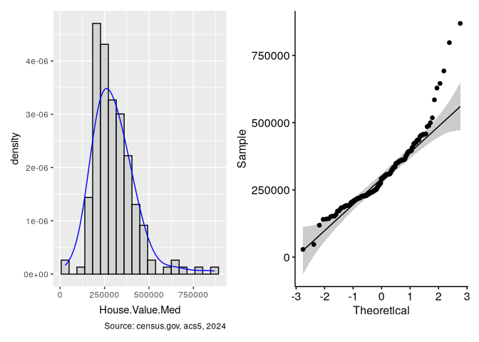

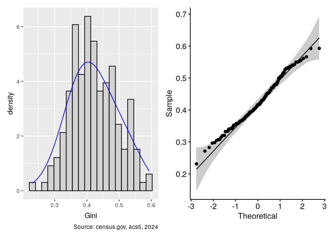

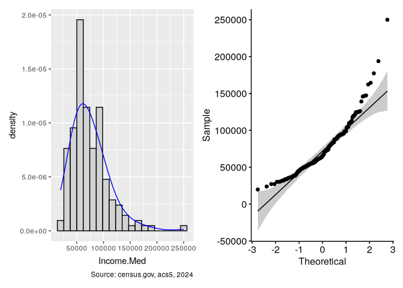

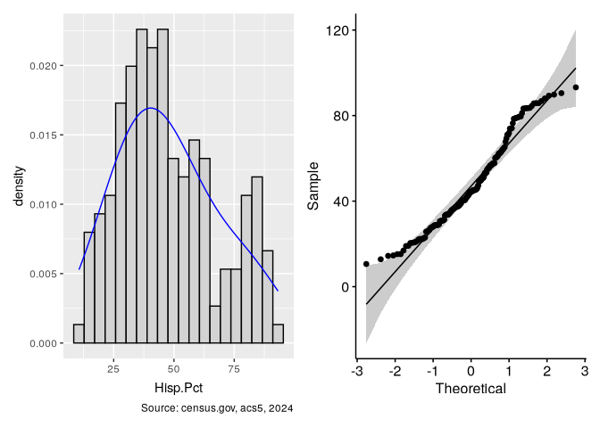

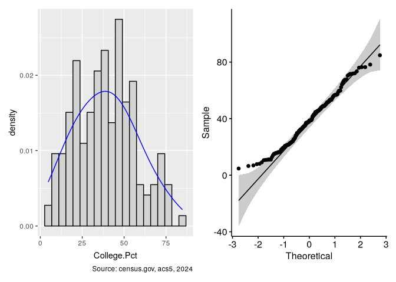

The data is not, for the most part, normally distributed. This will pose
challenges to analysis of variance, and will certainly require
appropriate transformations. It is interesting to get a sense of the
geographic distribution with regard to these variables. I want to split
the data into quantiles rather than using a continuous scale. This is
where `tmap` really shines, and one of the few areas where `ggplot`
makes life a bit difficult, since the cuts must be manually generated
prior to plotting. Never-the-less, I will use `ggplot`.

The `classInt` package will generate the break points, which I will use
to `cut` the data. I find the bracket/parenthesis syntax for ranges
visually tedious, hence the `str_replace` funcitons. Also note the use
of `%!in%`, another fast function from `collapse`.

``` r
council_dists <- st_read("../data/district_variance.gpkg", 
                         layer = "council_dists")
```

    Reading layer `council_dists' from data source 
      `/home/biscotty/Projects/BWQuarto/biscottys-workshop/posts/data-science/r-census/data/district_variance.gpkg' 
      using driver `GPKG'
    Simple feature collection with 9 features and 1 field
    Geometry type: MULTIPOLYGON
    Dimension:     XY
    Bounding box:  xmin: 452000 ymin: 443500 xmax: 479832.8 ymax: 467857.3
    Projected CRS: NAD83(2011) / New Mexico Central

``` r
dist_plot <- function(df = council_dists, labels = TRUE) {
  p <- ggplot(df) +
    annotation_map_tile(
      type = "osm", zoomin = -1, cachedir = "~/.cache/maps/"
    ) +
    geom_sf(aes(color = district), linewidth = 2) +
    scale_color_brewer(palette = "Set3") +
    labs(title = "Albuquerque, NM",caption = caption) +
    theme_void()
  if (labels) {
    p <- p + geom_sf_text(aes(label = district)) + guides(color = "none")
  }
  p
}
```

``` r
make_cuts <- function(var) {
  quantiles <- classIntervals(var, 5, style = "quantile")
  cut(
    var, quantiles$brks,
    include.lowest = TRUE, dig.lab = 6
  ) %>%
    str_replace_all(",", " - ") %>%
    str_replace_all("[\\(\\]\\[]", "")
}

cuts <- map(num_var_names,
    \(x) make_cuts(to_df(abq_data)[[x]]))

quantile_map <- function(cut, lab) {
  dist_plot() +
      geom_sf(
        data = abq_data,
        aes(fill = cut), alpha = 0.5
      ) +
      geom_sf_text(
        data = council_dists %>%
          fsubset(district %!iin% c("Los Ranchos", "Unincorporated")),
        aes(label = district)
      ) +
      scale_fill_viridis_d() +
      labs(fill = lab) +
      theme_void()
}

c(
  pHouse.Value.Med, pGini,
  pRent.Med, pAge.Med, pIncome.Med, pForeign.Born.Pct,
  pHisp.Pct, pCollege.Pct, pPopulation.Density,
  pVacant.Pct, pRenter.Occupied.Pct, pHousing.Density
) %<-%
  map2(
    cuts, num_var_names,
    \(cut, lab) quantile_map(cut, lab)
  )

pHouse.Value.Med; pIncome.Med; pGini; pHisp.Pct; pCollege.Pct
```

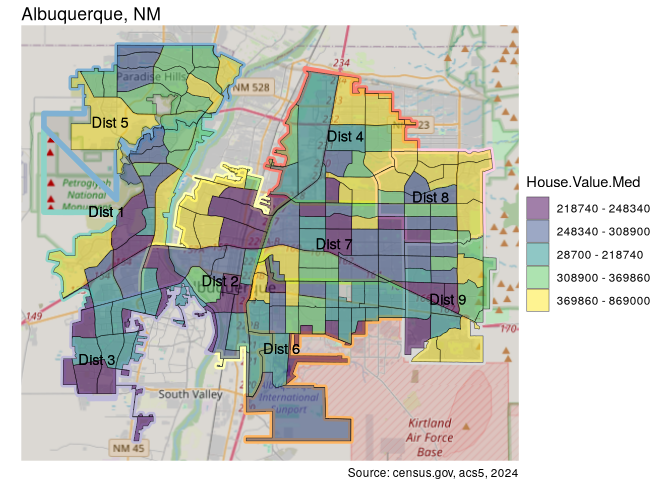

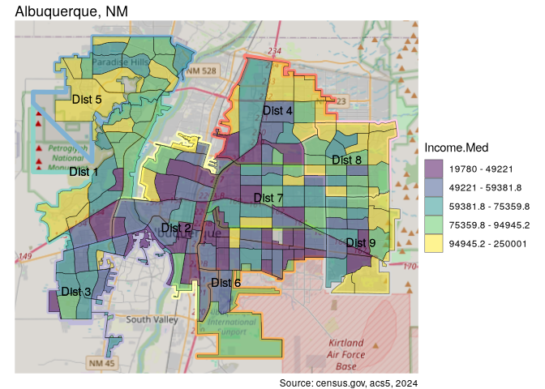

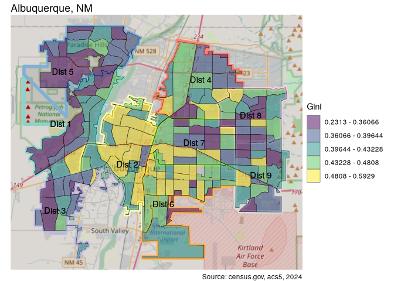

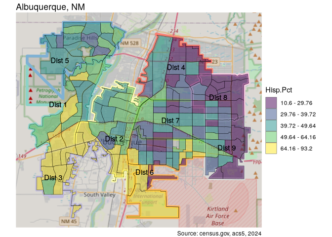

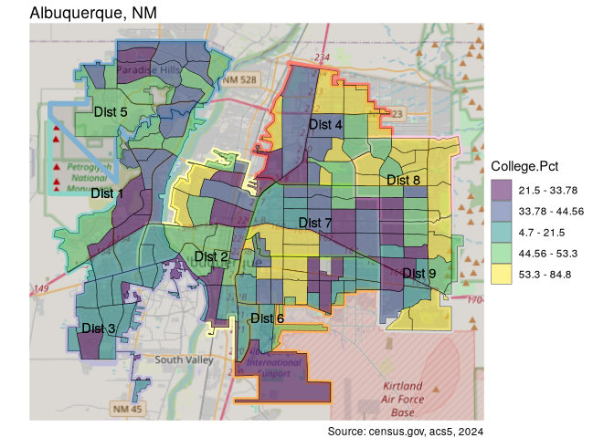

Housing values and income levels seem to be geographically distributed
similarly, as one might expect, with higher levels in the more outlying
areas and lower levels in centrally located areas. The patches of high
income and high percent of college graduatges in the central areas are
those aroung the University of New Mexico. This “abberation” is evident
in all the maps. Inequality levels seem to follow an opposite tendency,
with higher levels in the interior of the city.

The percentage of Hispanics is highest in the southwest of the city,
decreasing northward and, much more significantly, eastward. It is in
some ways the mirror image of the percentage of college graduates. When
looking at variable correlation, I expect to see a strong negative
correlation between these variables.

## Correlation

Next, let’s look at the correlation between variables.

``` r
abq_data %<>% to_df
ggpairs(num_vars(abq_data)) +
  theme_gray(base_size = 8)
```

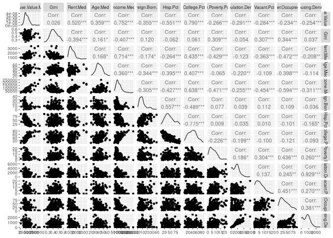

``` r
correlation <- cor(num_vars(abq_data)) %>% melt
ggplot(correlation) +
  geom_tile(aes(x = Var1, y = Var2, fill = value)) +
  labs(title = "Correlation Heatmap",
       x = "Variable 1",
       y = "Variable 2") +
  scale_fill_distiller(palette = "RdBu", direction = 1) +
  theme(axis.text.x = element_text(angle = 45, hjust = 1)) +
  labs(x = NULL, y = NULL, fill = "Corr", caption = caption)
```

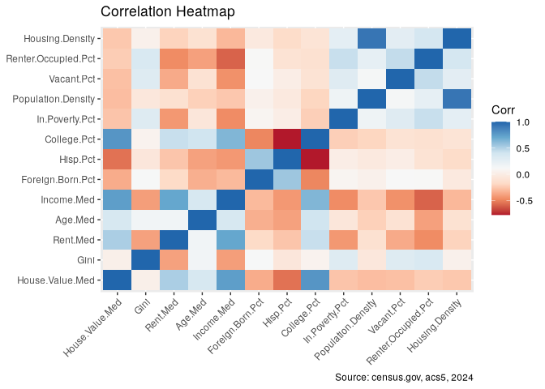

As anticipated, a strong negative correlation between areas with high
percentage of Hispanics and those with high percentage of college grads
jumps out in the heatmap. It is not surprising that many variables are
correlated, some quite highly. for example housing density and
population density, or housing values with income, and even more
strongly with percentage of college graduates. On the other hand, the
negative correspondance between house prices and Hispanics is strong.

Economic inequality is most evident in areas with a high percentage of
rentals, vacancies and lower rent prices. Areas with higher incomes and
lower poverty levels have less economic inequality.

In data in which so many variables appear correlated, it is interesting
to note those which are not. For example, inequality does not seem to be
related to any of the demographic variables, only the economic
indicators. Poverty seems not to care about age, race, or where one is
from.

The percentage of rentals in a given area have a strong negative
correlation with the income levels in the area. Some of the negative
correlations are striking. Hispanic percentage is strongly negatively
correlated with both housing values and percentage of people with a
college education.

## Spatial autocorrelation

We are often influenced by our neighbors. Birds of a feather flock
together, as they say. Or, more canonically, “everything is related to
everything else, but near things are more related than distant things.”
(Waldo Tobler’s First Law of Geography) Spatial autocorrelation is based
on this idea. Neighbor relationships can be generally defined in two
ways: if only considering regions which share a border to be neighbors,
this is described as a “rook” relationship. Were one to also include
areas which merely touch, which are in a sense “diagonal” to each other,
would be a “queen” relationship. Since Albuquerque is laid out almost
entirely as a strict rectangular grid, with little opportunity for
diagonal movement, I will use the “rook” relationship.

### Global

Moran’s $I$ is commonly used to test whether or not variables are
randomly distributed through an area. Significant p-values indicate
spatial autocorrelation, in other words, that variable values in one
area are correlated to their neighbors. Performing the test requires
creating a neighbor list and, from that, a weights list, which is then
passed to the `moran.test` function.

``` r
abq_data %<>% to_sf()
nb <- poly2nb(abq_data, queen = F, snap = 25)
nbw <- nb2listw(nb, style = "W", zero.policy = T)

vars_list <- to_df(abq_data) %>% num_vars

map(
  vars_list,
  \(x) moran.test(x, nbw, alternative = "two.sided") %>% tidy
) %>%
  unlist2d %>% 
  get_vars(c(1, 5:6))
```

                       .id statistic      p.value
    1      House.Value.Med 11.419221 3.352234e-30
    2                 Gini  5.317358 1.052849e-07
    3             Rent.Med  9.009281 2.074109e-19
    4              Age.Med  6.994478 2.662486e-12
    5           Income.Med 11.505808 1.233286e-30
    6     Foreign.Born.Pct  9.491078 2.286579e-21
    7             Hisp.Pct 15.797737 3.224857e-56
    8          College.Pct 13.455702 2.850180e-41
    9       In.Poverty.Pct  4.320696 1.555378e-05
    10  Population.Density  5.377221 7.564430e-08
    11          Vacant.Pct  9.192920 3.823183e-20
    12 Renter.Occupied.Pct  7.350233 1.978620e-13
    13     Housing.Density  5.876167 4.198755e-09

The positive statistic values indicate positive spatial autocorrelation,
or clustering of similar values. Negative values would indicate the
opposite, ie. clustering of dissimilar values. The low p-values show
that all of these are statistically significant. Higher values indicate
stronger autocorrelation. In this case, all of the variables show such
correlation.

One way to visualize this is with `moran.plot`, which produces spatially
lagged plots. I will only select five of the variables for this
exercise, and will subset the data in the interest of efficiency.

``` r
abq_data_ss <- abq_data %>% 
  fselect(House.Value.Med, Income.Med, Gini, Hisp.Pct, College.Pct)
vars_list_ss <-  num_vars(to_df(abq_data_ss))
num_var_names_ss <- num_vars(abq_data_ss, return = "names")
mplots <-
  map2(
    vars_list_ss,
    num_var_names_ss,
    \(x, y) moran.plot(x, nbw, xlab = y)
  )
```

The spatial lag plots show the spatial autocorrelation of the variables,
as they are generally gathered near the mean line. The lower left
quadrant contains tracts with low values clustered with other low values
(low-low), while the upper right quadrant contains observations with
spatially autocorrelated high values (high-high). Both the Hispanic and
college percentages have high statistic values (15.80 and 13.46), and
the plots show most observations tightly grouped along the diagonal.
Gini, on the other hand, has the relatively low value of 5.32, and the
graph displays how much wider spread the laggged observations are.

### Local Clusters

To get a sense of where these variables are, and where similar values
are clustered, we need to use the local versions of the Moran test,
which compares each tract to it’s neighbors. The `localmoran` function
does the calculation.

``` r
lmorans <- map(num_var_names_ss,
               \(x) localmoran(abq_data_ss[[x]], nbw, alternative = "two.sided"))
```

I will use this to produce maps showing

``` r
moran_map <- function(cut) {
  dist_plot() +
      geom_sf(
        data = abq_data_ss,
        aes(fill = cut), alpha = 0.5
      ) +
      geom_sf_text(
        data = council_dists %>%
          fsubset(district %!iin% c("Los Ranchos", "Unincorporated")),
        aes(label = district)
      ) +
      theme_void()
}

mmaps <- map(
  seq(1, length(num_var_names_ss)),
  \(idx) {
    p1 <- quantile_map(
      make_cuts(abq_data_ss[[num_var_names_ss[idx]]]),
      glue("{num_var_names_ss[idx]}")
    )
    p2 <- moran_map(
      cut(lmorans[[idx]][, "Z.Ii"], c(-Inf, -1.96, 1.96, Inf))
    ) +
      scale_fill_viridis_d(
        glue("{num_var_names_ss[idx]}\nLocal Moran's I"),
        labels = c("Negative SAC", "No SAC", "Positive SAC")
      )
    p3 <- moran_map(
      cut(lmorans[[idx]][, "Pr(z != E(Ii))"], c(-Inf, 0.05, Inf))
    ) +
      scale_fill_viridis_d(
        glue("{num_var_names_ss[idx]}\np-value"),
        labels = c("< 0.05", ">= 0.05")
      )
    list(p1, p2, p3)
  }
)

(lmaps <- c(
  lmpHouse.Value.Med, lmpIncome.Med, 
  lmpGini, mpHisp.Pct, lmpCollege.Pct
) %<-% map(mmaps,
    \(x) {
      c(p1, p2, p3) %<-% x
      p1 + plot_spacer() + p2 + p3
    }))
```

    [[1]]

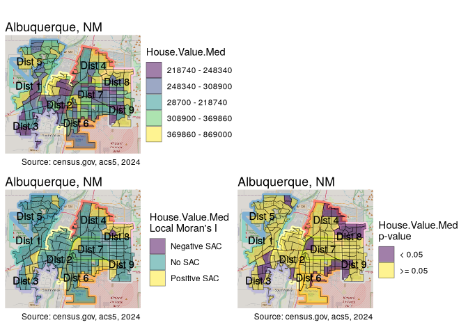


    [[2]]

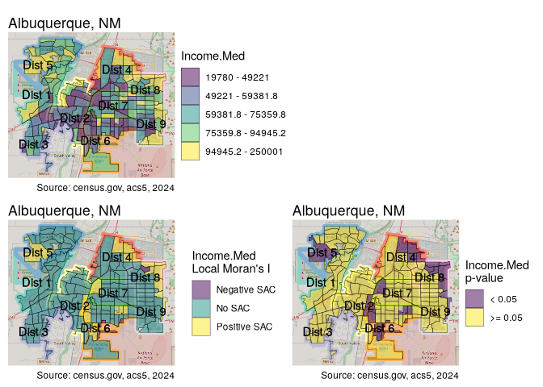


    [[3]]

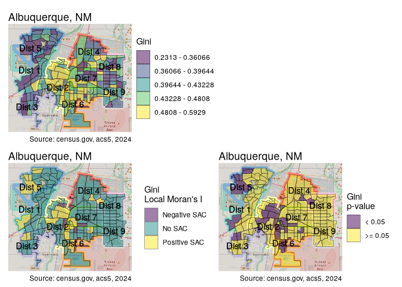


    [[4]]

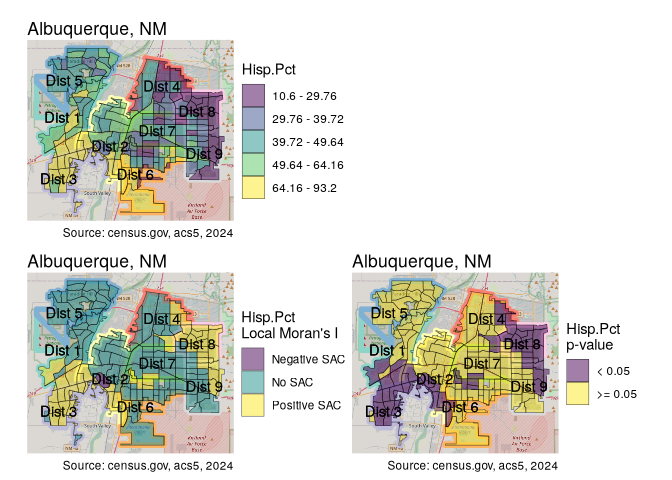


    [[5]]

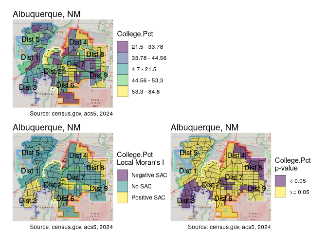

The Moran plots we saw earlier were divided into quadrants, the lower
left being areas of “low-low” correlation, with the upper right being
“high-high”. As a final exercise, I will map the statistically
significant areas of correlation. I will start by scaling the data with
`collapse`’s `fscale`.

``` r
abq_data_scaled <- abq_data_ss %>% to_df %>% fscale %>% to_sf
mplots <-
  map2(
    num_vars(to_df(abq_data_scaled)),
    num_var_names_ss,
    \(x, y) moran.plot(x, nbw, xlab = y)
  )
```

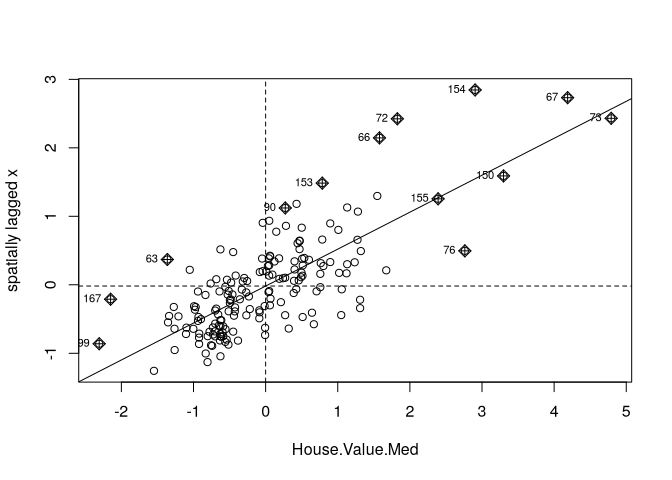

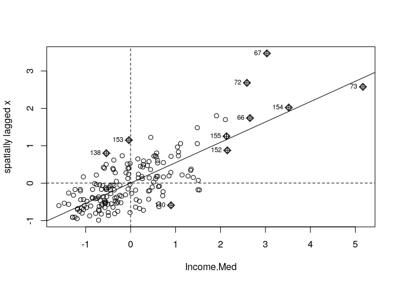

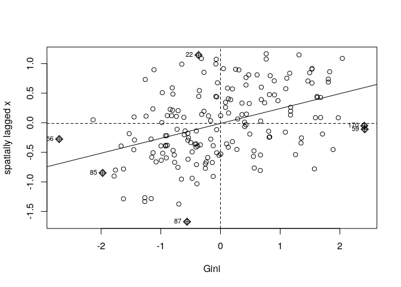

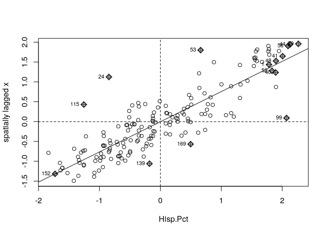

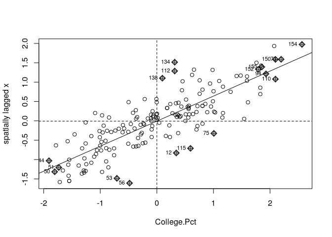

``` r
plot_nbr <- function(df, var, fill = quadrant) {
  dist_plot() +
    geom_sf(data = df, aes(fill = quadrant), 
            alpha = 0.3, show.legend = T) +
    scale_fill_discrete(
      var,
      palette = c("red", "blue", "lightpink", "skyblue2", "white"),
      labels = c(
        "High-High", "Low-Low", "High-Low",
        "Low-High", "Non-significant"
      ),
      drop = FALSE
    )
}

map_clusters <- function(var) {
  data <- fselect(abq_data_scaled, var)
  lmp <- localmoran(data[[var]],
    nbw,
    alternative = "two.sided"
  )[, 5]

  mpc <- mplots[[var]]

  data %<>% fmutate(
    lmp = lmp,
    quadrant = factor(
      case_when(
        lmp > 0.05 ~ 5,
        mpc$x >= 0 & mpc$wx >= 0 ~ 1,
        mpc$x <= 0 & mpc$wx <= 0 ~ 2,
        mpc$x >= 0 & mpc$wx <= 0 ~ 3,
        mpc$x <= 0 & mpc$wx >= 0 ~ 4
      ),
      levels = 1:5
    )
  )

  plot_nbr(data, var)
}

map(num_var_names_ss, map_clusters)
```

    [[1]]

    Zoom: 11

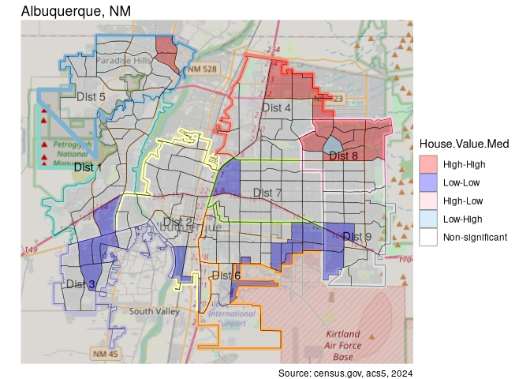


    [[2]]

    Zoom: 11

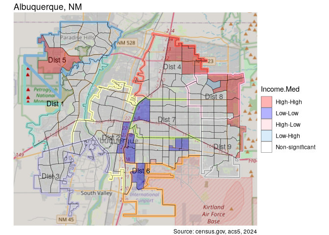


    [[3]]

    Zoom: 11

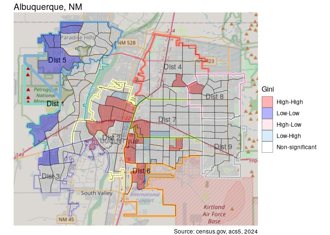


    [[4]]

    Zoom: 11

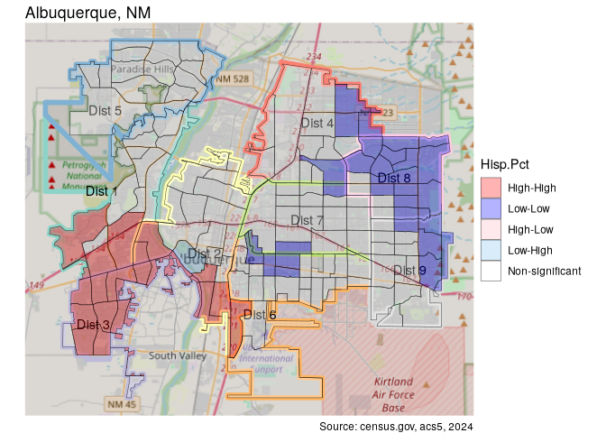


    [[5]]

    Zoom: 11

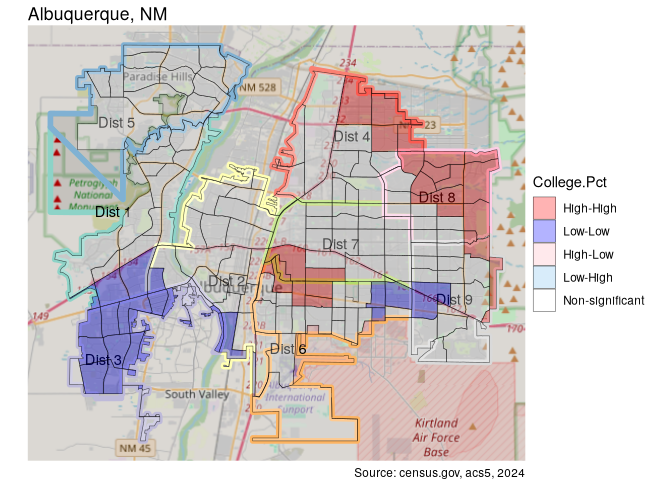

Neighborhoods with high house values are clustered in the north east.
The southern area of low-low house values is the area with the highest
crime and homelessness, euphemistically dubbed the “International
District”.

The income map is similar, although the high-high areas in the east
stretch down along the foothills of Sandia Mountain, an . There is also
a surprisingly large patch of high-high in the northwest in the fifth
district. The low-low income areas are mainly located along the I-25
corridor.

As for inequality, high areas are clustered in the center, while low
areas of inequality are clustered in the west. The university areas show
areas of low inequality surrounded by areas of high inequality.

College percentage and Hispanic percentage are virtual mirror images
geographically. The number of significant areas is much higher, and both
show a significant NW-SE axis. The patch of low Hispanic and high
percentage of college degrees in the center is the are around the
University of New Mexico.
