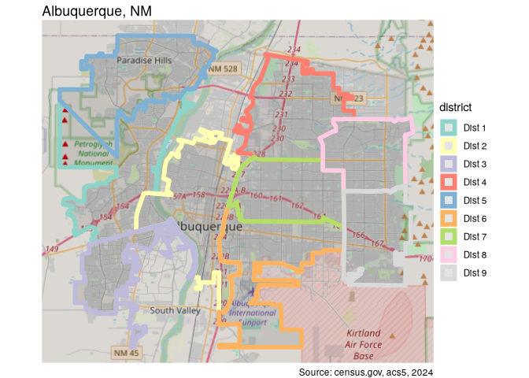
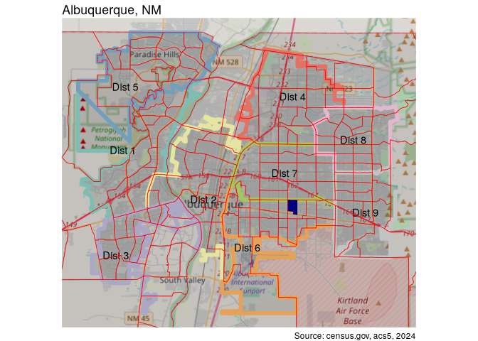
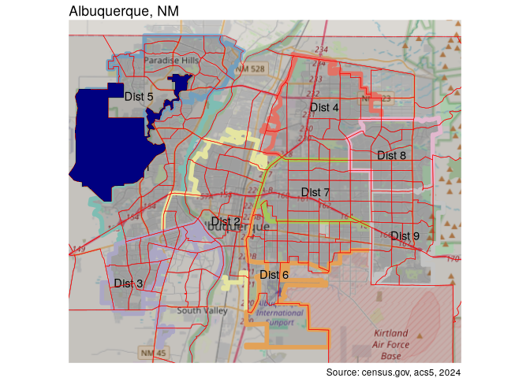
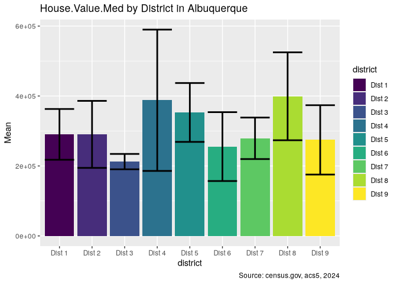
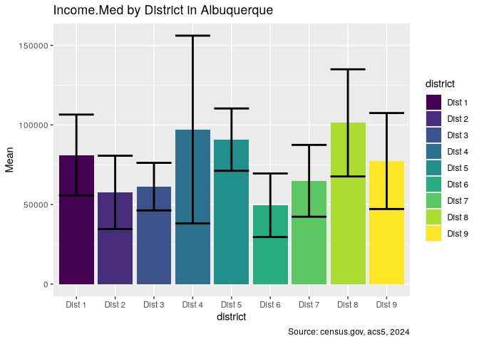
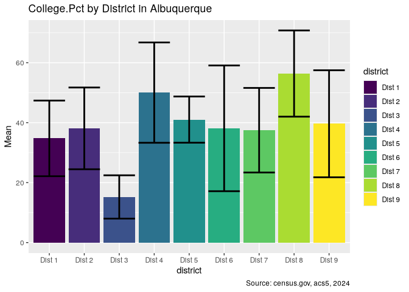
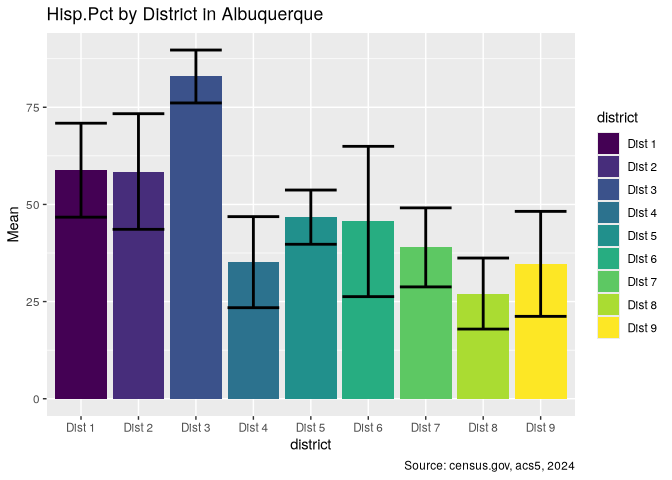

# Demographic and Economic Variance in Albuquerque

2026-08-12

- [Introduction](#introduction)
- [Loading libraries](#loading-libraries)
- [Council District Geometries](#council-district-geometries)
- [Census Data](#census-data)
  - [Fetching](#fetching)
  - [Cleaning](#cleaning)
- [The Albuquerque District Dataset](#the-albuquerque-district-dataset)
  - [Variable Engineering](#variable-engineering)
  - [More Cleaning](#more-cleaning)
  - [Quick plots](#quick-plots)

# Introduction

This article follows on from an [earlier
article](https://biscotty.net/posts/data-science/r-census/abq-demographics)
in which I used data from the US Census Bureau to see how age, race, and
education vary between city council districts in Albuquerque, New
Mexico. In some cases, the variations appeared striking. Now I would
like to apply some formal testing to see if this impression of variance
is backed up statistically. As in the prior article, I will use data
from the US Census American Community Survey. In addition to the
demographic variables of education and race, I will add a number of
economic indicators such as income levels, housing values, and
inequality measurements. Before being able to run the tests, and
eventual models, a significant amount of data wrangling will be
necessary in order to get the data in an appropriate form,with
appropriate variables, from the raw data.

Having obtained the data, I will need clean out bad data, fill in
missing values, engineer new variables of interest, and divide the
spatial dataset by council districts. I will then explore correlation
and *spatial autocorrelation* between the chosen variables. Next I will
perform an analysis of variance, but since almost none of the variables
will turn out to be normally distributed, some more work will be
necessary to transform the data. I will also need to address issues of
homogeneity of variance among the districts. Finally, I will do some
regression modeling. Since my primary target variable is the county
districts, this will require multinomial logistic regression models.

This would be far too much for one article, so I will split the
excercise into four parts. The current article will be concerned with
preparing the data. I have another purpose here, which is to highlight
how data analysis and transformation can be significantly sped up by
using the `collapse` package instead of the ubiquitous `dplyr` library.
`dplyr` is without doubt wonderfully expressive and, as a key part of
the popular `tidyverse`, sets a syntactical approach which has been
widely adopted, and justifiably so. While the syntactic standard is
excellent, it is not, unfortunately, a particularly fast library.
`collapse`, on the other hand, while embracing the syntactical
conventions of `dplyr` (unlike `data.table`), focuses on speed. It is
orders of magitude faster, and it is even much faster than `data.table`.
Written in C/C++, it has “fast” versions of many commonly-used `dplyr`
functions, simply with a prepended “f”, eg. `fmutate` rather than
`mutate`. It provides many new fast statistical functions,
transformations, and convenience functions. Throughout, I will show
speed comparisons between `dplyr` and `collapse` using the
`microbenchmark` package.

# Loading libraries

I will begin by loading the required libraries and setting some
constants. This project will require functions dozens of libraries, but
in most cases only one or two functions from any given library is
needed. Rather than loading entire packages, I will load the primary
libraries in full, and then the single functions from the other
packages. This approach also has the virtue of declaring all package
dependencies at the beginning, an excellent programming practice.

``` r
options(paged.print = FALSE,
        tigris_use_cache = TRUE)
libraries <- list(
  "sf", "collapse", "ggplot2", "magrittr", "dplyr",
  "zeallot", "purrr", "patchwork"
)
invisible(lapply(libraries, library, character.only = TRUE))

microbenchmark <- microbenchmark::microbenchmark
glue <- glue::glue
annotation_map_tile <- ggspatial::annotation_map_tile
set_units <- units::set_units
st_remove_holes <- nngeo::st_remove_holes
get_acs <- tidycensus::get_acs
rownames_to_columns <- tibble::rownames_to_column

year <- 2024
crs <- 6528
caption <- glue("Source: census.gov, acs5, {year}")
```

# Council District Geometries

I’ll start by preparing the council district spatial dataset. I did the
same in the last article, but this time I’ll use `collapse` functions.

``` r
council_dists <- st_read("../data/BC_CityCouncil/ABQ_CityCouncils.shp") %>%
  fselect(district = DISTRICTNU) %>% 
  ftransform(district = paste("Dist", district)) %>%
  roworder(district) %>% 
  st_remove_holes %>% 
  st_cast("MULTIPOLYGON")
los_ranchos <- st_read("../data/LosRanchos/LosRanchos.shp") %>%
  fselect(district = Name)
council_dists <-
  rowbind(council_dists, los_ranchos) %>%
  st_transform(crs)
```

`fselect` works just like `select`. `collapse` also has an `fmutate`
function which is the fast version of `mutate`, and which I could have
used here. When no grouping is required, however, `ftransform` is even
faster than `fmutate` because it evaluates all arguments simultaneously.
`roworder` replaces `arrange`, and `rowbind` replaces `rbind`. Finally,
`qF` is used instead of `factor`. `collapse` offers a number of
functions for fast conversion between data types, such as `qTBL` to
convert to a `tibble`, `qM` to convert to a matrix, and `qDF` to convert
to a data frame. *In general, the more primitive the type, the faster
the processing*. When spatial information is unnecessary, I will use
data frames for processing, converting back to spatial data frames for
mapping and spatial analysis.

Note that, after removing the “holes”, the geometries of `council_dists`
will be a mix of POLYGONSs and MULTIPOLYGONs. This will generate errors
in various future operations, so I will use `st_cast` to ensure
consistency.

My study area is a rectangular region that is a bit smaller than the
actual city limits. This will cut out some outlying areas. Also, as
mentioned before, there are many patches of unincorporated county in the
geographic area. Above I used `st_remove_holes` to include enclaves of
unincorporated county in the respective districts. For the rest, I will
explicitly label these areas as “Unincorporated”, obtaining the
geometries for the region by taking the `st_difference` between the
rectangular bounding box of the `council_dists` and the union of the
council district geometries.

``` r
dist_box = c(xmin = 452000, xmax = 479833, 
             ymin = 443500, ymax = 467858)

council_dists %<>% 
  st_crop(dist_box) %>% 
  st_cast("MULTIPOLYGON")

difference_sfc <-
  st_difference(
    st_as_sfc(st_bbox(council_dists)),
    st_union(council_dists$geometry)
  )
difference_sf <- 
  st_sf(data.frame(district = "Unincorporated"),
  geometry = difference_sfc
)
council_dists <- rowbind(difference_sf, council_dists)
```

I have used `%<>%`, a lesser-used function from `magrittr`, which
replaces the tedious yet ubiquitous idiom `data <- data %>%` with the
simpler and shorter `data %<>%`. It is similar to modifiying by
reference. I have also, again, needed to recast the geometries after the
cropping operation. Now I will create a base plot for the rest of the
study which shows the district boundaries.

``` r
dist_plot <- function(df = council_dists, labels = TRUE) {
  p <- ggplot(df) +
    annotation_map_tile(
      type = "osm", zoomin = -1, cachedir = "~/.cache/maps/"
    ) +
    geom_sf(aes(color = district), linewidth = 2) +
    scale_color_brewer(palette = "Set3") +
    labs(title = "Albuquerque, NM",caption = caption) +
    theme_void()
  if (labels) {
    p <- p + geom_sf_text(aes(label = district)) + guides(color = "none")
  }
  p
}

council_dists %<>%
  fsubset(district %!in% c("Los Ranchos", "Unincorporated"))
dist_plot(labels = FALSE)
```



I will save the council district definitions for future use.

``` r
st_write(council_dists, "../data/district_variance.gpkg", 
         layer = "council_dists", append = F)
```

# Census Data

## Fetching

The `get_acs()` function from `tidycensus` obtains information from the
American Community Survey tables published by the US Census Department.
By supplying a named vector to the `variables` argument, the columns of
the returned data table will be automatically renamed. Setting
`geometry = TRUE` returns an `sf` object, and `output = "wide"` gives a
column for each variable. After obtaining the data, I will remove the
margin of error columns, remove the trailing “E” from the remaining
column names, and transform the geometry to an appropriate coordinate
reference system. `get_vars` is a more flexible version of `fselect`. As
you can see, it can select by either index or name, and can also use
regular expressions for column selection.

``` r
vars_census <- c(
  House.Value.Med = "B25077_001",
  Housing.Units = "B25001_001",
  Renter.Occupied = "B25003_003",
  Vacant = "B25002_003",
  Income.Med = "DP03_0062",
  Gini = "B19083_001",
  Rent.Med = "B25031_001",
  Foreign.Born.Pct = "DP02_0094P",
  Hisp.Pct = "DP05_0090P",
  In.Poverty = "B17001A_002",
  Age.Med = "B01002_001",
  College.Pct = "DP02_0068P",
  Population = "B01003_001"
)

bern_data <- get_acs(
  geography = "tract",
  state = "NM",
  county = "Bernalillo",
  variables = vars_census,
  output = "wide",
  year = year,
  geometry = TRUE,
  cache_table = TRUE
) %>%
  get_vars(c("E$", "GEOID"), regex = TRUE) %>%
  get_vars(-2) %>%
  frename(\(x) sub("E$", "", x)) %>%
  st_transform(crs)
```

## Cleaning

Let’s take a look at the data before splitting it between districts.
I’ll use `qsu`, `collapse`’s fast version of `summary`.

``` r
qsu(bern_data)
```

                        N        Mean          SD    Min     Max
    GEOID             176           -           -      -       -
    House.Value.Med   166  303775.904  126616.382  28700  869000
    Housing.Units     176   1720.1477    685.5887      0    3814
    Renter.Occupied   176     575.233    470.4958      0    2423
    Vacant            176      98.017     87.0864      0     403
    Gini              173      0.4183      0.0737  0.068  0.5929
    Rent.Med          167   1306.5868    461.5261    425    3501
    In.Poverty        176     235.892    207.3682      0    1161
    Age.Med           174     40.9632      8.4063   19.8    66.3
    Population        176   3829.1477   1636.8032      0   11669
    Income.Med        172  75168.8779   34757.922  19780  250001
    Foreign.Born.Pct  174     10.1443      7.5109      0    39.2
    Hisp.Pct          174     47.4213     21.3292      0    93.2
    College.Pct       174      37.681     18.8133      0    84.8

It is worth noting that the geometry column does not appear in this
summary. For the most part, `collapse` ignores the fact that the data is
an `sf` object.

There is some clean-up to do. There are some missing values to explore,
and oddities like areas where the population total is 0. I’ll deal with
the zero-population areas first. `fsubset` here is like `dplyr`’s
`filter`. `collapse` also provides a fast versions of the logical
operators `==`, `!=`, and `%in%` (`%==%`, `%!=%`, `%iin%`).

``` r
bern_data %>% 
  fsubset(Population %==% 0)
```

    Simple feature collection with 2 features and 14 fields
    Geometry type: MULTIPOLYGON
    Dimension:     XY
    Bounding box:  xmin: 413766.6 ymin: 429075.1 xmax: 509166.4 ymax: 468330.2
    Projected CRS: NAD83(2011) / New Mexico Central
    # A tibble: 2 × 15
      GEOID      House.Value.Med Housing.Units Renter.Occupied Vacant  Gini Rent.Med
      <chr>                <dbl>         <dbl>           <dbl>  <dbl> <dbl>    <dbl>
    1 350019408…              NA             0               0      0    NA       NA
    2 350019803…              NA             0               0      0    NA       NA
    # ℹ 8 more variables: In.Poverty <dbl>, Age.Med <dbl>, Population <dbl>,
    #   Income.Med <dbl>, Foreign.Born.Pct <dbl>, Hisp.Pct <dbl>,
    #   College.Pct <dbl>, geometry <MULTIPOLYGON [m]>

It is worth comparing this with the `dyplr` equivalent.

``` r
microbenchmark(
  dp = bern_data %>% filter(Population == 0),
  co = bern_data %>% fsubset(Population %==% 0)
)
```

    Unit: microseconds
     expr     min       lq      mean  median       uq      max neval cld
       dp 730.802 781.8320 806.40727 798.659 816.2945 1655.325   100  a 
       co   7.200   8.4285  12.60105  10.821  16.8040   41.665   100   b

The `collapse` version of this very common operation is over 50 times
faster than `dplyr`’s! Now, let’s see where the tract is.

``` r
dist_plot() +
  geom_sf(data = bern_data, color = "red") +
  geom_sf(data = fsubset(bern_data, Population %==% 0),
          fill = "navy") +
  lims(x = dist_box[1:2], y = dist_box[3:4])
```

    Zoom: 11



This tract is the state fairgrounds. The other must be outside the study
area. I’ll remove both.

``` r
bern_data %<>% fsubset(Population %!=% 0)
```

The population of 16 is somewhat suspicious.

``` r
dist_plot() +
  geom_sf(data = bern_data, color = "red") +
  geom_sf(
    data = fsubset(bern_data, Population < 20),
    fill = "navy"
  ) +
  lims(x = dist_box[1:2], y = dist_box[3:4])
```

    Zoom: 11



This is the Petroglyph National Monument, and the 16 people must be park
rangers. I’ll remove this as well.

``` r
bern_data %<>% fsubset(Population > 20)
```

This only leaves the missing values. Let’s take a closer look. `keep` is
from the `purrr` library, allowing functional selection of columns.

``` r
na_cols <- st_drop_geometry(bern_data) %>% 
  keep(~anyNA(.x)) %>% colnames
bern_data %>% 
  st_drop_geometry %>% 
  fsubset(missing_cases(bern_data)) %>% 
  gv(na_cols) 
```

    # A tibble: 12 × 4
       House.Value.Med   Gini Rent.Med Income.Med
                 <dbl>  <dbl>    <dbl>      <dbl>
     1          206500  0.592       NA      50329
     2              NA  0.4        867      30810
     3              NA  0.476      861      27168
     4              NA  0.419      956      33875
     5              NA  0.453      942      37088
     6          869000  0.357       NA     250001
     7          225100  0.403       NA      87645
     8              NA  0.373     1095      48333
     9          271500  0.394       NA      72926
    10           98900  0.306       NA      46783
    11              NA  0.333     1766      83774
    12              NA NA           NA         NA

As you might guess `missing_cases` is from `collapse`, and is the fast,
though opposite, of `complete.cases`. `complete.cases`, however, cannot
be used on an `sf` object without dropping the geometry, while
`missing_cases` can, and it is nearly 100 times faster than the `dplyr`
idiom. (One important aspect of `collapse` is that it preserves
attributes, and is generally agnositc as to the class of a table,
although this is not entirely seamless for `sf` objects.) `collapse`
also provides “short-hand” versions of some functions. In this case `gv`
is short for `get_vars`.

``` r
microbenchmark(
  dp = bern_data %>%
    filter(if_any(everything(), is.na)),
  co = bern_data %>%
    fsubset(missing_cases(bern_data))
)
```

    Unit: microseconds
     expr      min        lq       mean    median       uq      max neval cld
       dp 1752.918 1871.3285 1977.08450 1920.7970 1989.271 3565.264   100  a 
       co   12.671   14.7325   22.47754   19.9335   28.752   58.270   100   b

`collapse` is nearly 100 times faster.

These observations do seem worth preserving. I will fill in the missing
values based on the median values for each variable, mean in the case of
Gini, but I would like these values to be based on the averages for the
specific district, rather than an overall averages, so I will go ahead
and split the data into districts at this point.

I want to remember the rows with missing values so I can check that they
get filled in. I can’t just use row indices, since these will change
after splitting into districts. Instead I’ll grab the `GEOID`s. I am
also using shorthand verbs provided by `collapse`: `gv`, short for
`get_vars`, and `ss`, short for `fsubset`.

``` r
missing <- (bern_data %>%
  st_drop_geometry() %>%
  ss(missing_cases(bern_data)))[["GEOID"]]
```

I will preserve the county data for future use.

``` r
st_write(bern_data, "../data/district_variance.gpkg",
    layer = "bern_data", append = F)
```

# The Albuquerque District Dataset

Splitting the data requires intersecting the county census data with the
geometries from the district dataset. Any given tract’s boundaries may
cross two or even three districts. Since some of the variables are
extensive, representing counts, these values will need to be apportioned
based on the percentage area represented by each subsection. I’ll
calculate the initial area of each tract, then the areas of each
newly-created sub-section, which will then allow me to divide each
tract’s data by the percentage area lying in the newly created areas.
I’ll also make `district` a factor.

``` r
abq_data <- bern_data %>%
  ftransform(area = st_area(.)) %>%
  st_intersection(council_dists) %>%
  ftransform(area_pct = as.numeric(st_area(.) / area)) %>% 
  fsubset(district %!iin% c("Los Ranchos", "Unincorporated")) %>% 
  ftransform(district = qF(district))
```

## Variable Engineering

I want to create some new variables from the raw data. First, I will
turn the raw poverty numbers into a percentage of each tract’s
population. I’ll also create housing and population density variables
based on tract area, and vacancy and renter occupied variables that are
a percentage of available housing units in each tract.

`ftransformv` takes a vector of column identifiers, in this case column
names, and applies a function to them, in this case an anonymous
function, using the `FUN` argument. `ftransform` is similar to
`fmutate`, although it has some different rules, such as the variables
being non-recursive. I’m also taking advantage of some quick column
arithmetic. `%c/%` is shorthand for column division. `collapse` provides
a range of such functions for row and column math, eg. `%c*%`. Note also
that `ftransform` allows you to remove colums easily with the syntax
`variable = NULL`.

Finally, I will use `st_cast` to ensure consistent geometries, since,
after intersection operation, there are likely to be a mix of POLYGONs
and MULTIPOLYGONs, which will cause trouble down the line for the
spatial analyses.

``` r
ext_vars <- c("Population", "Housing.Units", "Renter.Occupied", "Vacant", "In.Poverty")

abq_data %<>%
  ftransformv(
    ext_vars,
    FUN = function(x) round(x * abq_data$area_pct, 0)
  ) %>%
  ftransform(
    In.Poverty.Pct = In.Poverty %c/% Population * 100,
    Population.Density = Population %c/% area %>%
      set_units("1/km^2") %>% as.numeric,
    Vacant.Pct = Vacant %c/% Housing.Units * 100,
    Renter.Occupied.Pct = Renter.Occupied %c/% Housing.Units * 100,
    Housing.Density = Housing.Units %c/% area %>%
      set_units("1/km^2") %>% as.numeric,
    In.Poverty = NULL, Vacant = NULL, Housing.Units = NULL,
    Renter.Occupied = NULL, area = NULL
  ) %>%
  colorder(district, pos = "front") %>% 
  st_cast("MULTIPOLYGON")
```

Now I want to fill in the missing values with grouped averages. I’ll
start by creating a grouping object. I could simply provide a column,
but it is somewhat faster to do it this way if you plan to re-use the
same grouping multiple times. This is similar, to the `ftransform`
above, but the syntax is a little more complicated since I need to
supply the `g` (group) and `TRA` (transformation) arguments. There are
ten different possible values for `TRA`, including “fill” for replacing
all variables, “-” for subtracting (centering) and “/” for dividing
(scaling). In this case I am simply replacing the `NA` values.

I am modifying the data by reference here by using `settransform` rather
than `transform`. A number of `collapse`’s functions provide this
alternative.

``` r
dist_grp <- GRP(abq_data$district)

settransform(abq_data,
  fmean(list(
    In.Poverty.Pct = In.Poverty.Pct,
    Vacant.Pct = Vacant.Pct,
    Renter.Occupied.Pct = Renter.Occupied.Pct),
    g = dist_grp, TRA = "replace_NA"))

settransform(abq_data,
  fmedian(list(
    House.Value.Med = House.Value.Med,
    Rent.Med = Rent.Med, Income.Med = Income.Med),
    g = dist_grp, TRA = "replace_NA"))

abq_data %>%
  st_drop_geometry %>% 
  fsubset(GEOID %iin% missing) %>%
  gv(na_cols)
```

    # A tibble: 16 × 4
       House.Value.Med  Gini Rent.Med Income.Med
                 <dbl> <dbl>    <dbl>      <dbl>
     1          241200 0.419     956       33875
     2          225100 0.403    1094       87645
     3          219100 0.373    1095       48333
     4          357700 0.453     942       37088
     5          869000 0.357    1335      250001
     6          271500 0.394    1470.      72926
     7           98900 0.306    1470.      46783
     8          206500 0.592     920.      50329
     9          227650 0.4       867       30810
    10          227650 0.476     861       27168
    11          227650 0.333    1766       83774
    12          206500 0.592    1138       50329
    13          248600 0.476     861       27168
    14          248600 0.453     942       37088
    15          206500 0.592    1186       50329
    16          251700 0.333    1766       83774

## More Cleaning

All missing values have been filled in. However, there is a new problem:

``` r
qsu(abq_data)
```

                           N        Mean          SD     Min        Max
    district             256           -           -       -          -
    GEOID                256           -           -       -          -
    House.Value.Med      256  295625.195  116039.083   28700     869000
    Gini                 256      0.4266        0.07  0.2313     0.5929
    Rent.Med             256   1279.9629    434.2917     632       3501
    Age.Med              256     40.3887      8.2295    19.8       66.3
    Population           256   2068.0508    2095.164       0      11152
    Income.Med           256  71624.9805  32590.6795   19780     250001
    Foreign.Born.Pct     256     10.4441      7.5116       0       39.2
    Hisp.Pct             256     48.0937      20.604    10.6       93.2
    College.Pct          256     37.8488       18.01     2.8       84.8
    area_pct             256      0.5264      0.4621       0          1
    In.Poverty.Pct       256       5.528      5.0507       0    33.3333
    Population.Density   256   1008.8517   1115.1273       0  5955.4623
    Vacant.Pct           256      4.7517      4.2574       0    20.2716
    Renter.Occupied.Pct  256     34.1215     23.0123       0        100
    Housing.Density      256    476.4714    535.5719       0  2575.2589

The split data now contains new areas with a population of 0. As a
result of the splitting, there are numerous small fragments of tracts
containing little if any information. To address this, I will remove all
of the new rows which represent less than 1% of the original area. I’ll
also remove unnecessary columns.

``` r
abq_data %<>% 
  fsubset(area_pct > .01) %>% 
  ftransform(GEOID = NULL, Population = NULL, area_pct = NULL)
qsu(abq_data)
```

                           N        Mean          SD     Min        Max
    district             173           -           -       -          -
    House.Value.Med      173  301837.283  118373.506   28700     869000
    Gini                 173      0.4222      0.0707  0.2313     0.5929
    Rent.Med             173   1318.1994    449.6551     647       3501
    Age.Med              173     40.1746      8.0354    19.8       66.3
    Income.Med           173  74096.8266  34036.1653   19780     250001
    Foreign.Born.Pct     173     10.4139      7.4977       0       39.2
    Hisp.Pct             173      47.596     20.1354    10.6       93.2
    College.Pct          173     38.8607     17.9201     4.7       84.8
    In.Poverty.Pct       173         6.5      4.7024       0    22.4014
    Population.Density   173   1491.9935   1058.0258  0.4385  5955.4623
    Vacant.Pct           173      5.5673      4.3509       0    20.2716
    Renter.Occupied.Pct  173     34.3278     21.1953  2.6316    92.3077
    Housing.Density      173    704.6709    513.5183  0.2002  2575.2589

## Quick plots

While data exploration will be the subject of the next article, I will
make some quick plots of a few of the variables, using the `qsu`
function.

``` r
plot_simple <- function(df, var) {
  ggplot(data = df, aes(x = district, y = Mean)) +
    geom_col(aes(fill = district)) +
    scale_fill_viridis_d() +
    geom_errorbar(aes(ymin = Mean - SD, ymax = Mean + SD),
      color = "black", linewidth = 1
    ) +
    labs(
      title = glue("{var} by District in Albuquerque"),
      caption = caption
    )
}

map(
  c("House.Value.Med", "Income.Med", "College.Pct", "Hisp.Pct"),
  \(x) qsu(abq_data, formula(glue("{x} ~ district"))) %>%
  qDF() %>% rownames_to_columns(var = "district") %>%
  plot_simple(x))
```

    [[1]]




    [[2]]




    [[3]]




    [[4]]



Some of the variables surely look quite different when compared across
districts. Finally, I will save the data for use in the next article.

``` r
st_write(abq_data, "../data/district_variance.gpkg",
    layer = "abq_data", append = F)
```
