# Albuquerque Demographics


# Introduction

I am interested in the differences in economic conditions across
different parts of Albuquerque. More specifically, I want to see how
they vary between city council districts. Before doing so, I want to get
a sense of the basic demographics of the city, both how they compare the
the state and country, and how the districts compare demographically. To
do so, I will access data from [census.gov](https://data.census.gov/all)
using the `tidycensus` package. I will need to get the district lines
from a local government website and, since census tracts do not line up
with council districts, the census data will need to be apportioned
between the council districts.

A large portion of this article is concerned with programming in R. For
those uninterested in coding, and would just like to see the data, you
are invited to go straight to
<a href="#sec-explore-data" class="quarto-xref">Section 3</a>. Data
analysis inevitably involves repeating the same thing with minor changes
or updates over and over. To do so efficiently while minimizing errors,
custom functions are required. When incorporating `tidyverse` functions
into these, some special syntax is needed. I’ll also show how to
leverage `purrr`’s `map` family of functions to streamline code, and how
to apply the `%<-%` operator from the `zeallot` package to produce
powerful, clear and concise expressions.

# Preparing the data

I will use the following libraries, as well as a palette from
`RColorBrewer`:

``` r
library(tidycensus)
library(tidyverse)
library(ggspatial)
library(sf)
library(units)
library(crsuggest)
library(gt)
library(gtExtras)
library(ggtext)
library(glue)
library(patchwork)
library(janitor)
library(nngeo)
library(zeallot)
options(tigris_use_cache = TRUE)
```

And set the following constants, the first two of which are essentially
parameters for the analysis.

``` r
crs <- 6528
year <- 2023
source <- str_glue("Source: census.gov, acs5, {year}")
```

## City Council Districts

First I will obtain the boundaries for the city council districts. The
Albuquerque website provides a wealth of data, although it is not
necessarily well-structured. In many of the data sets, the relevant data
is contained in columns of `html`, from which the tables need to be
extracted. I’ll get to that when I incorporate crime statistics later.
This case is even worse, as the website’s council district table only
provides councilors’ names as a variable, not district numbers. And the
names provided are for councilors from several years ago!

Dealing with local government data portals is hit and miss. Fortunately,
the Bernalillo County website provides what I need, as well as providing
the shape for the Village of Los Ranchos de Albuquerque. Los Ranchos is
sort of the Beverly Hills of Albuquerque, in the sense that it is a
separate municipal enclave (almost) entirely surrounded by Albuquerque,
and where many of the larger properties and houses in the area are
located. I’ll want to include it on maps.

The data portal for Bernalillo County is *not* very friendly for
programmatic downloading, though. My first effort to download and unzip
the file containing the city council boundaries failed to produce a
usable file. Adding the argument `method = "curl"` allowed me to
download the files, however.

``` r
download.file(
  "https://www.berncoclerk.gov/wp-content/uploads/2025/07/BERNCO_CLERKJuly2025.gdb_.zip",
  destfile = "data/bernalillo.zip", method = "curl"
)
unzip("data/bernalillo.zip", overwrite = T)
```

I will read the file with `sf::st_read`, which will result in an `sf`
object. The only variable I’m interested in is the district number, so
I’ll just grab that, fix the variable name, and make the content more
descriptive for plots and maps.

``` r
council_dists <-
  st_read("data/BC_CityCouncil/ABQ_CityCouncils.shp") %>%
  select(district = DISTRICTNU) %>%
  mutate(district = paste("District", district))
```

    Reading layer `ABQ_CityCouncils' from data source 
      `/home/biscotty/Projects/BWQuarto/biscottys-workshop/posts/data-science/r-census/abq-demographics/data/BC_CityCouncil/ABQ_CityCouncils.shp' 
      using driver `ESRI Shapefile'
    Simple feature collection with 9 features and 11 fields
    Geometry type: POLYGON
    Dimension:     XY
    Bounding box:  xmin: 1454193 ymin: 1436226 xmax: 1574255 ymax: 1534960
    Projected CRS: NAD83(HARN) / New Mexico Central (ftUS)

I’ll do the same for Los Ranchos.

<details class="code-fold">
<summary>Show the code</summary>

``` r
download.file(
  "https://www.berncoclerk.gov/wp-content/uploads/2023/02/LosRanchos.zip",
  "data/test.zip",
  method = "curl"
)
unzip("data/LosRanchos.zip")
```

</details>

<details class="code-fold">
<summary>Show the code</summary>

``` r
los_ranchos <-
  st_read("data/LosRanchos/LosRanchos.shp") %>%
  select(district = Name)
```

</details>

    Reading layer `LosRanchos' from data source 
      `/home/biscotty/Projects/BWQuarto/biscottys-workshop/posts/data-science/r-census/abq-demographics/data/LosRanchos/LosRanchos.shp' 
      using driver `ESRI Shapefile'
    Simple feature collection with 1 feature and 8 fields
    Geometry type: MULTIPOLYGON
    Dimension:     XY
    Bounding box:  xmin: 1512612 ymin: 1505061 xmax: 1529234 ymax: 1524577
    Projected CRS: NAD83(HARN) / New Mexico Central (ftUS)

Now I will bind them and transform the coordinate reference system to a
local one in meters. I set it as a constant at the beginning in case I
want to re-run everything with a different projection.

``` r
council_dists <-
  rbind(council_dists, los_ranchos) %>%
  st_transform(crs)
```

> [!TIP]
>
> ### Finding a Coordinate Reference System
>
> The `crsuggest` package has a useful function to determine an
> appropriate coordinate reference system.
>
> ``` r
> suggest_crs(council_dists) %>% head(2)
> ```
>
>     # A tibble: 2 × 6
>       crs_code crs_name                         crs_type crs_gcs crs_units crs_proj4
>       <chr>    <chr>                            <chr>      <dbl> <chr>     <chr>    
>     1 6529     NAD83(2011) / New Mexico Centra… project…    6318 us-ft     +proj=tm…
>     2 6528     NAD83(2011) / New Mexico Central project…    6318 m         +proj=tm…

I’ll be plotting the district boundaries with `ggplot` ane add a base
map with `ggspatial::annotation_map_tile`. This will provide the
foundation for later demographic maps.

``` r
dist_plot <- function(df) {
  ggplot(df) +
    annotation_map_tile(
      type = "osm", alpha = 0.7,
      zoomin = -1, cachedir = "~/.cache/maps/"
    ) +
    geom_sf(aes(color = district), fill = NA, linewidth = 1) +
    geom_sf_label(aes(label = district),
      fontface = "bold",
      nudge_y = 1000, nudge_x = -500, fill = "gray",
      label.padding = unit(0.1, "lines"),
      size = 3.5
    ) +
    scale_color_viridis_d() +
    theme_void() +
    labs(title = "Albuquerque Council Districts")
}
```

``` r
dist_plot(council_dists)
```

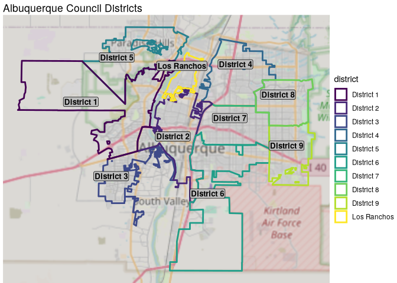

One thing to notice on this map is that there are numerous areas of
unincorporated Bernalillo County which geographically seem to lie inside
Albuquerque’s borders but do not actually belong to any city district. A
closer look reveals some of these holes.

``` r
council_dists %>%
  filter(district %in% c(
    "District 2", "District 4",
    "District 5", "Los Ranchos"
  )) %>%
  dist_plot()
```

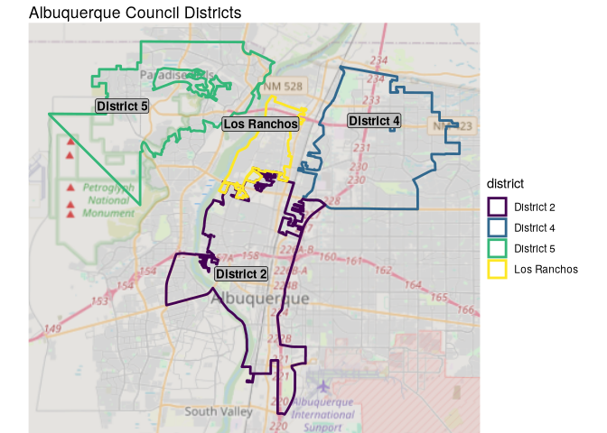

This will become relevant later as we map the census data into the
districts, as some of the data will lie outside city boundaries, and be
“lost”. I do think it makes sense to fill in the holes in the middles of
districts, however. I’ll use the convenient `st_remove_holes()` function
from the `nngeo` package to do so.

``` r
council_dists <- st_remove_holes(council_dists)
```

I can check to see that the holes are gone.

<details class="code-fold">
<summary>Show the code</summary>

``` r
dist_plot(council_dists)
```

</details>

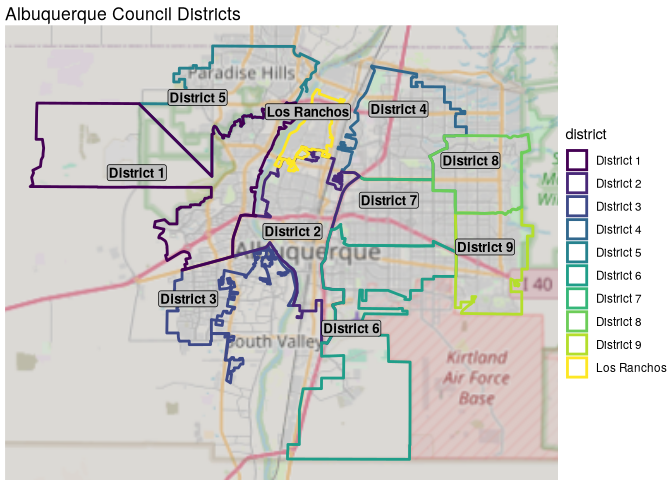

<details class="code-fold">
<summary>Show the code</summary>

``` r
council_dists %>%
  filter(
    district %in% c(
      "District 2", "District 4",
      "District 5", "Los Ranchos"
    )
  ) %>%
  dist_plot()
```

</details>

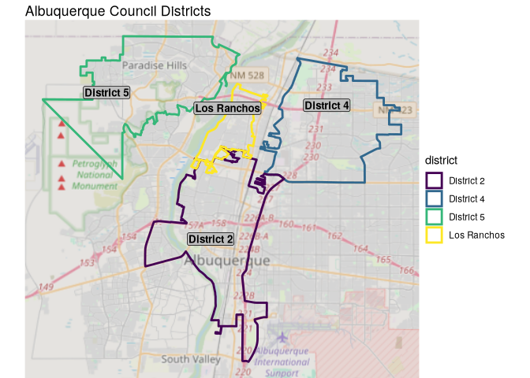

## Working with census data

Now I will get the age, sex, race and educational demographic data. I
will use tables from 2023’s five-year American Community Survey. These
tables are not like the decennial census data which contains “actual”
numbers, rather they are estimates together with margins of error based
on surveys collected on an on-going basis. The data is available at
different levels of granularity, and can optionally provide geometries
for spatial analysis, manipulation and mapping. I need tract level data
for my study area, which is the most detail provided, and I need the
geometries in order to divide the data between the council districts and
do mapping. I also want to compare to state-wide and country-wide data,
so I’ll grab that data as well, but I don’t need the geometry in those
cases, since I won’t be mapping or splitting that data.

`tidycensus` provides the `get_acs` function to download the survey
data. It takes a series of pretty self-explanatory arguments. I’ll do
this many times for different tables, so here is a function to do that.
I’ll use the `year` constant which I set at the beginning to be 2023.

``` r
get_tables <-
  function(geography, table, labels,
           state = NULL, county = NULL,
           geometry = F) {
    if (geography != "us") state <- "NM"
    if (geography == "tract") county <- "Bernalillo"
    get_acs(
      geography = geography,
      state = state,
      county = county,
      table = table,
      year = year,
      geometry = geometry,
      cache_table = T
    ) %>%
      clean_names() %>%
      select(-2) %>%
      clean_names() %>%
      left_join(labels)
  }
```

The `geography` will be either “us”, “state” or “tract”. Depending on
the level, the `state` and/or `county` arguments will or won’t be
needed, so these have been initialized with a default value of `NULL`.
The `geometry` argument determines whether or not an `sf` object is
returned instead of a `tibble`. Then I’ll drop an unneeded column, use
`janitor` to clean the names, and join the labels, which have yet to be
defined.

One problem with the census tables is that they contain variable
“names”, which are actually non-descriptive alpha-numeric strings. For
tables, plotting, and just exploring data, they are useless. On the
other hand, manually changing the names would be unacceptably tedious
and error prone. Instead, I’ll use `tidycensus::load_variables`. This
downloads all the available variables together with descriptions and
other information. Browsing the table with `View` is a good way to find
which variables you need. The descriptions can also be used to replace
the variable “name” with a descriptive label. The descriptions
themselves need cleaning, though. This function cleans up the
descriptions and inserts a `_` where it will later be used to create
discrete columns for sex and age group.

``` r
get_labels <- function(table) {
  load_variables(year, "acs5") %>%
    filter(str_detect(name, table)) %>%
    select(1:2) %>%
    mutate(
      label = str_replace(label, "Estimate!!Total:!!", ""),
      label = str_replace(label, "Estimate!!", ""),
      label = str_replace(label, ":!!", "_"),
      label = str_replace(label, ":$", "")
    ) %>%
    rename(variable = name)
}
```

Now, I will write the splitting function. For Bernalillo County, I want
to be able to divide the data by district. To do so, I will first need
to calculate the area for each tract. I can do this when I download the
data. I will then use `st_intersection`, which will create new rows with
separate geographies for those tracts which are divided among multiple
districts. The values associated with each tract are not automatically
split among the subsections however, so I must do that manually. Since
they are all counts (extensive variables), I will calculate the areal
proportion of each subsection, and use these percentages to divide the
values among the subsections.

``` r
split_dists <- function(df, vars) {
  st_intersection(df, council_dists) %>%
    mutate(
      area_split = st_area(.),
      area_pct = area_split / area,
      new_value = as.numeric(round(value * area_pct, 0))
    )
}
```

## Tables, graphs and maps

I will use the `gt` package to create tables. For the tables, I need to
pivot the data so I have columns for each region or district. I also
often want to use percentages instead of raw numbers, so I’ll calculate
those.

These functions requires some special syntax, however, since many
`tidyverse` functions use bare column names rather than strings, eg.
`select(column)` instead of `select("column")`. This is problematic when
using these functions within other functions, because those column names
must be passed as string arguments to the outer function. Therefore, the
special syntax is required when writing such nested functions. For
grouping, there is the handy `group_by_at()` function, which takes a
string as a variable name. Within other functions from the tidyverse, we
need to use `.data[["variable"]]` to refer to columns. Here, I need it
in both `pivot_wider` and `arrange`.

``` r
prepare_tables <- function(df, group, variable) {
  totals <- df %>%
    group_by_at(group) %>%
    summarise(total = sum(value))
  df %>%
    group_by_at(c(variable, group)) %>%
    summarise(value = sum(value)) %>%
    left_join(totals) %>%
    mutate(percent = value / total) %>%
    select(-c(total, value)) %>%
    pivot_wider(
      names_from = .data[[group]],
      values_from = percent
    ) %>%
    ungroup()
}

print_table <- function(df, group, title, subtitle = "", pct = T) {
  df %>%
    arrange(.data[[group]]) %>%
    gt(rowname_col = group) %>%
    {
      if (pct) fmt_percent(., columns = everything(), decimals = 1)
      else fmt_number(., columns = everything(), decimals = 0)
    } %>%
  tab_style(
      style = cell_text(align = "center"),
      locations = cells_column_labels(columns = everything())
    ) %>%
    tab_header(
      title = md(title),
      subtitle = md(subtitle)
    ) %>%
    tab_source_note(source_note = source) %>%
    tab_style(
      style = cell_text(align = "right"),
      locations = cells_source_notes()
    ) %>%
    gt_theme_espn() %>%
    opt_align_table_header(align = "center") %>%
    cols_align(align = "center", columns = everything()) %>%
    data_color(
      palette = "RColorBrewer::RdBu", direction = "row",
      method = "bin"
    )
}
```

I’ll want to show some percentages on maps, too. This is similar to the
`prepare_tables` function above.

``` r
calculate_dist_percents <- function(df1, df2) {
  totals <- df1 %>%
    group_by(district) %>%
    summarise(total = sum(value))
  df2 %>%
    group_by(district) %>%
    summarise(value = sum(value)) %>%
    left_join(totals) %>%
    mutate(
      percent = value / total,
      label = glue("{round(percent, 3) * 100}%")
    )
}


map_demo <- function(sf, pct = T) {
  dist_plot(council_dists) +
    {
      if (pct) geom_sf(data = sf, aes(fill = percent), alpha = 0.35)
      else geom_sf(data = sf, aes(fill = value), alpha = 0.35)
    } +
    {
      if (pct) scale_fill_viridis_c(labels = scales::label_percent())
      else scale_fill_viridis_c(labels = scales::label_comma())
    } +
    geom_sf_label(
      data = council_dists,
      aes(label = district), fontface = "bold",
      nudge_y = 1000, nudge_x = -500, fill = "gray",
      label.padding = unit(0.1, "lines"), size = 3.5
    ) +
    geom_sf_label(
      data = sf,
      aes(label = label),
      fill = "grey", nudge_y = -1000
    ) +
    guides(color = "none") +
    labs(
      title = ifelse(pct, "Percentage of the population", "Population"),
      caption = source,
      fill = NULL
    )
}
```

Finally, I will write a couple of functions for bar graphs. I’ll need to
use the `.data[[]]` syntax in the `aes()` functions. The first combines
men and women, while the second splits them out.

``` r
compare_plot <- function(df, fill, x_var, position = "fill") {
  df %>%
    ggplot(aes(
      x = .data[[x_var]],
      y = value,
      fill = .data[[fill]]
    )) +
    geom_col(position = position) +
    scale_fill_viridis_d() +
    theme(axis.title = element_blank()) +
    labs(caption = source)
}

mf_plot <- function(df, groups, pos) {
  df %>%
    group_by_at(groups) %>%
    summarise(value = sum(value)) %>%
    mutate(value = ifelse(sex == "Male", -value, value)) %>%
    ggplot(aes(x = value, y = .data[[groups[pos]]], fill = sex)) +
    geom_col() +
    theme(
      axis.ticks = element_blank(),
      axis.text.x = element_blank(),
      axis.title.y = element_blank()
    )
}
```

To be honest, I haven’t really prepared any data yet, I’ve only prepared
to prepare the data. The actual data preparation will be shown at the
beginning of each section, as every data set has its own peculiarities.

# Exploring the data

## Age and Sex

> [!NOTE]
>
> ### Data preparation
>
> Now I can start getting the demographic data, starting with age and
> sex. I will use my `get_labels` function to get the labels for the
> table variables, then download the first dataset. I will set factor
> levels so that the graphs show the correct order, as well as
> separating the label into different columns. For the county data, I’ll
> request an `sf` object with `geometry = T`, use the `crs` defined
> earlier, and calculate the area of each tract, which I’ll need later
> for splitting.
>
> ``` r
> age_sex_labels <- get_labels("B01001A")
>
> age_sex_bern <-
>   get_tables("tract", "B01001A", age_sex_labels, geometry = T) %>%
>   st_transform(crs) %>%
>   mutate(area = st_area(.)) %>%
>   filter(str_detect(label, "years")) %>%
>   separate(label, c("sex", "agegroup"), sep = "_") %>%
>   select(geoid, sex, agegroup, value = estimate, area)
> ```
>
> Now I can get the national and state data, for which I need simple
> tibbles. Here I’ll use `purrr::map()` together with the `%<-%`
> operator from the `zeallot` package. For people with a functional
> programming bent, this is a match made in heaven. Many of the `map`
> functions from `purrr` such as `map_dfr` have been deprecated in favor
> of the simple `map` (or `map2` or `pmap`). This is fine, except that
> `map` returns a list, which must be “unpacked” to assign the results.
> `%<-%` provides LHS destructuring, allowing you to pass a vector of
> names on the left side of the expression, each of will be assigned an
> item from the list returned by `map`.
>
> I will supply an anonymous or `lambda` function to `map`. Note that
> the `\(x)` syntax is preferred now over the old `function()` or `~`
> style of writing anonymous functions. I’ll preserve the `sf` object
> for future mapping.
>
> ``` r
> c(age_sex_us, age_sex_nm) %<-%
>   map(
>     c("us", "state"),
>     \(x) get_tables(x, "B01001A", age_sex_labels) %>%
>       filter(str_detect(label, "years")) %>%
>       separate(label, c("sex", "agegroup"), sep = "_") %>%
>       select(sex, agegroup, value = estimate) %>%
>       as_tibble() %>%
>       mutate(agegroup = factor(agegroup, unique(agegroup)))
>   )
>
> age_sex_dist_sf <- age_sex_bern %>%
>   split_dists() %>%
>   select(
>     geoid, district, sex, agegroup, value, new_value, area_pct
>   ) %>%
>   mutate(agegroup = factor(agegroup, unique(agegroup)))
>
> age_sex_dist <- st_drop_geometry(age_sex_dist_sf)
> ```
>
> For now I’m keeping some variables I don’t really need. This will help
> me evaluate the results of the splitting operation. I am expecting a
> certain amount of data loss, since some tracts and parts of tracts lie
> outside the council districts, even though I filled in interior holes.
> I would like to do a visual sanity check to verify that the loss makes
> sense. I’ll first look at a small portion to see how much difference
> there is.
>
> ``` r
> age_sex_bern %>%
>   st_drop_geometry() %>%
>   group_by(sex, agegroup) %>%
>   summarise(value = sum(value)) %>%
>   filter(agegroup == "35 to 44 years")
> ```
>
>     # A tibble: 2 × 3
>     # Groups:   sex [2]
>       sex    agegroup       value
>       <chr>  <chr>          <dbl>
>     1 Female 35 to 44 years 24412
>     2 Male   35 to 44 years 23451
>
> ``` r
> age_sex_dist %>%
>   group_by(sex, agegroup) %>%
>   summarise(value = sum(new_value)) %>%
>   filter(agegroup == "35 to 44 years")
> ```
>
>     # A tibble: 2 × 3
>     # Groups:   sex [2]
>       sex    agegroup       value
>       <chr>  <fct>          <dbl>
>     1 Female 35 to 44 years 20362
>     2 Male   35 to 44 years 19103
>
> There is quite a difference. Let’s see how this can occur by focusing
> in on one tract.
>
> ``` r
> age_sex_dist %>%
>   filter(geoid == 35001003501 & agegroup == "35 to 44 years")
> ```
>
>                geoid    district    sex       agegroup value new_value
>     37   35001003501  District 4   Male 35 to 44 years   112         2
>     51   35001003501  District 4 Female 35 to 44 years   331         5
>     37.1 35001003501  District 2   Male 35 to 44 years   112        12
>     51.1 35001003501  District 2 Female 35 to 44 years   331        36
>     37.2 35001003501 Los Ranchos   Male 35 to 44 years   112        21
>     51.2 35001003501 Los Ranchos Female 35 to 44 years   331        62
>               area_pct
>     37   0.0160136 [1]
>     51   0.0160136 [1]
>     37.1 0.1088052 [1]
>     51.1 0.1088052 [1]
>     37.2 0.1863676 [1]
>     51.2 0.1863676 [1]
>
> Here we are “losing” the majority of the population. Let’s look at the
> tract.
>
> ``` r
> dist_plot(council_dists) +
>   geom_sf(
>     data = age_sex_bern, color = "black",
>     fill = NA, linewidth = 0.5
>   ) +
>   geom_sf(
>     data = age_sex_bern %>% filter(geoid == 35001003501),
>     color = "red", fill = NA, linewidth = 2
>   ) +
>   guides(color = "none") +
>   xlim(460000, 470000) +
>   ylim(455000, 465000)
> ```
>
> 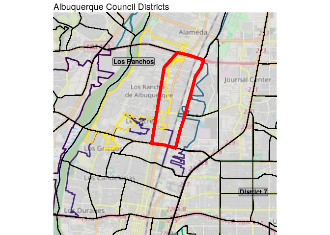
>
> We can see that, in fact, only small portions of the tract are in each
> of the two council districts and Los Ranchos, and that most of the
> area is, in fact, outside the city, so the data loss seems to make
> sense. I’m going to go ahead and redo the split, dropping the unneeded
> variables.
>
> ``` r
> age_sex_dist_sf <- age_sex_bern %>%
>   split_dists() %>%
>   select(geoid, district, sex, agegroup, value = "new_value") %>%
>   mutate(agegroup = factor(agegroup, unique(agegroup)))
>
> age_sex_dist <- st_drop_geometry(age_sex_dist_sf) %>%
>   as_tibble()
> ```

Now we can compare ages and sexes between Albuquerque, the state, and
the nation.

<details class="code-fold">
<summary>Show the code</summary>

``` r
p1 <- age_sex_us %>%
  mf_plot(c("sex", "agegroup"), pos = 2) +
  theme(legend.position = "none") +
  xlab("US")
p2 <- age_sex_nm %>%
  mf_plot(c("sex", "agegroup"), pos = 2) +
  theme(
    legend.position = "none",
    axis.text.y = element_blank()
  ) +
  xlab("New Mexico")
p3 <- age_sex_dist %>%
  group_by(sex, agegroup) %>%
  summarise(value = sum(value)) %>%
  mf_plot(c("sex", "agegroup"), pos = 2) +
  theme(
    axis.text.y = element_blank(),
    legend.title = element_blank()
  ) +
  xlab("Albuquerque")

pw <- p1 + p2 + p3
pw + plot_annotation(
  title = "Age and Sex Comparison",
  caption = source
)
```

</details>

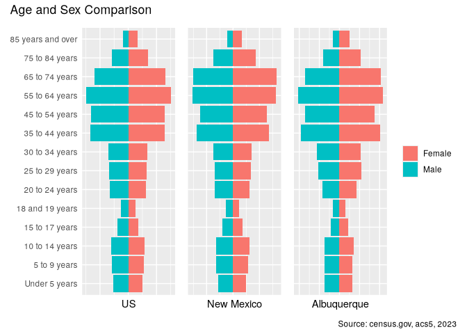

Overall, these profiles all seem pretty similar, although Albuquerque
would seem to have proportionally fewer teens and more 30 year olds than
the rest of the state or country. Lets compare the districts.

<details class="code-fold">
<summary>Show the code</summary>

``` r
age_sex_dist %>%
  filter(district != "Los Ranchos") %>%
  mf_plot(c("district", "sex", "agegroup"), pos = 3) +
  facet_wrap(~district) +
  labs(
    x = "population",
    caption = source
  ) +
  theme(axis.text.y = element_text(size = 5))
```

</details>

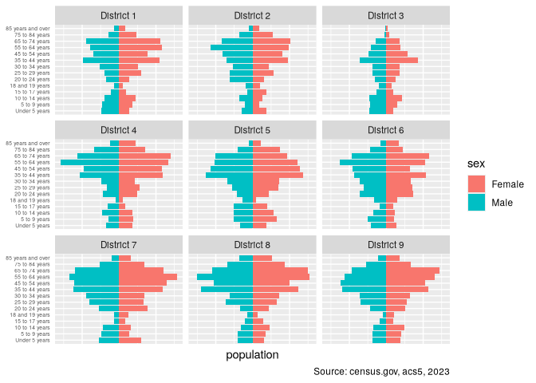

Across the city, on the other hand, there is considerable variability,
both in age and sex. For example sexual imbalance among 18 and 19 year
olds in District 5, where males strongly outnumber females, compared to
District 7 where the opposite is true. District 3 in particular would
seem to have a large proportion of children, while District 8 has many
more 35 and up.

It’s time to look at the numbers.

<details class="code-fold">
<summary>Show the code</summary>

``` r
age_sex_cmp <- age_sex_dist %>%
  group_by(sex, agegroup) %>%
  summarise(value = sum(value))

c(age_sex_cmp, age_sex_nm, age_sex_us) %<-%
  map2(
    list(age_sex_cmp, age_sex_nm, age_sex_us),
    c("Albuquerque", "New Mexico", "US"),
    \(df, region) df %>% mutate(region = region)
  )

age_sex_compare <- rbind(age_sex_cmp, age_sex_nm, age_sex_us)

age_sex_compare %>%
  prepare_tables("region", "agegroup") %>%
  mutate(agegroup = factor(agegroup, unique(agegroup))) %>%
  print_table(
    group = "agegroup",
    title = "**Comparison of Agegroups**"
  ) %>%
  cols_width(
    agegroup ~ px(155),
    everything() ~ px(110)
  )
```

</details>

<div id="pxbyjafyls" style="padding-left:0px;padding-right:0px;padding-top:10px;padding-bottom:10px;overflow-x:auto;overflow-y:auto;width:auto;height:auto;">
<style>@import url("https://fonts.googleapis.com/css2?family=Lato:ital,wght@0,100;0,200;0,300;0,400;0,500;0,600;0,700;0,800;0,900;1,100;1,200;1,300;1,400;1,500;1,600;1,700;1,800;1,900&display=swap");
#pxbyjafyls table {
  font-family: Lato, system-ui, 'Segoe UI', Roboto, Helvetica, Arial, sans-serif, 'Apple Color Emoji', 'Segoe UI Emoji', 'Segoe UI Symbol', 'Noto Color Emoji';
  -webkit-font-smoothing: antialiased;
  -moz-osx-font-smoothing: grayscale;
}
&#10;#pxbyjafyls thead, #pxbyjafyls tbody, #pxbyjafyls tfoot, #pxbyjafyls tr, #pxbyjafyls td, #pxbyjafyls th {
  border-style: none;
}
&#10;#pxbyjafyls p {
  margin: 0;
  padding: 0;
}
&#10;#pxbyjafyls .gt_table {
  display: table;
  border-collapse: collapse;
  line-height: normal;
  margin-left: auto;
  margin-right: auto;
  color: #333333;
  font-size: 16px;
  font-weight: normal;
  font-style: normal;
  background-color: #FFFFFF;
  width: auto;
  border-top-style: solid;
  border-top-width: 3px;
  border-top-color: #FFFFFF;
  border-right-style: none;
  border-right-width: 2px;
  border-right-color: #D3D3D3;
  border-bottom-style: solid;
  border-bottom-width: 2px;
  border-bottom-color: #A8A8A8;
  border-left-style: none;
  border-left-width: 2px;
  border-left-color: #D3D3D3;
}
&#10;#pxbyjafyls .gt_caption {
  padding-top: 4px;
  padding-bottom: 4px;
}
&#10;#pxbyjafyls .gt_title {
  color: #333333;
  font-size: 24px;
  font-weight: initial;
  padding-top: 4px;
  padding-bottom: 4px;
  padding-left: 5px;
  padding-right: 5px;
  border-bottom-color: #FFFFFF;
  border-bottom-width: 0;
}
&#10;#pxbyjafyls .gt_subtitle {
  color: #333333;
  font-size: 85%;
  font-weight: initial;
  padding-top: 3px;
  padding-bottom: 5px;
  padding-left: 5px;
  padding-right: 5px;
  border-top-color: #FFFFFF;
  border-top-width: 0;
}
&#10;#pxbyjafyls .gt_heading {
  background-color: #FFFFFF;
  text-align: center;
  border-bottom-color: #FFFFFF;
  border-left-style: none;
  border-left-width: 1px;
  border-left-color: #D3D3D3;
  border-right-style: none;
  border-right-width: 1px;
  border-right-color: #D3D3D3;
}
&#10;#pxbyjafyls .gt_bottom_border {
  border-bottom-style: solid;
  border-bottom-width: 2px;
  border-bottom-color: #D3D3D3;
}
&#10;#pxbyjafyls .gt_col_headings {
  border-top-style: solid;
  border-top-width: 2px;
  border-top-color: #D3D3D3;
  border-bottom-style: solid;
  border-bottom-width: 2px;
  border-bottom-color: #D3D3D3;
  border-left-style: none;
  border-left-width: 1px;
  border-left-color: #D3D3D3;
  border-right-style: none;
  border-right-width: 1px;
  border-right-color: #D3D3D3;
}
&#10;#pxbyjafyls .gt_col_heading {
  color: #333333;
  background-color: #FFFFFF;
  font-size: 80%;
  font-weight: bolder;
  text-transform: uppercase;
  border-left-style: none;
  border-left-width: 1px;
  border-left-color: #D3D3D3;
  border-right-style: none;
  border-right-width: 1px;
  border-right-color: #D3D3D3;
  vertical-align: bottom;
  padding-top: 5px;
  padding-bottom: 6px;
  padding-left: 5px;
  padding-right: 5px;
  overflow-x: hidden;
}
&#10;#pxbyjafyls .gt_column_spanner_outer {
  color: #333333;
  background-color: #FFFFFF;
  font-size: 80%;
  font-weight: bolder;
  text-transform: uppercase;
  padding-top: 0;
  padding-bottom: 0;
  padding-left: 4px;
  padding-right: 4px;
}
&#10;#pxbyjafyls .gt_column_spanner_outer:first-child {
  padding-left: 0;
}
&#10;#pxbyjafyls .gt_column_spanner_outer:last-child {
  padding-right: 0;
}
&#10;#pxbyjafyls .gt_column_spanner {
  border-bottom-style: solid;
  border-bottom-width: 2px;
  border-bottom-color: #D3D3D3;
  vertical-align: bottom;
  padding-top: 5px;
  padding-bottom: 5px;
  overflow-x: hidden;
  display: inline-block;
  width: 100%;
}
&#10;#pxbyjafyls .gt_spanner_row {
  border-bottom-style: hidden;
}
&#10;#pxbyjafyls .gt_group_heading {
  padding-top: 8px;
  padding-bottom: 8px;
  padding-left: 5px;
  padding-right: 5px;
  color: #333333;
  background-color: #FFFFFF;
  font-size: 80%;
  font-weight: bolder;
  text-transform: uppercase;
  border-top-style: solid;
  border-top-width: 2px;
  border-top-color: #D3D3D3;
  border-bottom-style: solid;
  border-bottom-width: 2px;
  border-bottom-color: #D3D3D3;
  border-left-style: none;
  border-left-width: 1px;
  border-left-color: #D3D3D3;
  border-right-style: none;
  border-right-width: 1px;
  border-right-color: #D3D3D3;
  vertical-align: middle;
  text-align: left;
}
&#10;#pxbyjafyls .gt_empty_group_heading {
  padding: 0.5px;
  color: #333333;
  background-color: #FFFFFF;
  font-size: 80%;
  font-weight: bolder;
  border-top-style: solid;
  border-top-width: 2px;
  border-top-color: #D3D3D3;
  border-bottom-style: solid;
  border-bottom-width: 2px;
  border-bottom-color: #D3D3D3;
  vertical-align: middle;
}
&#10;#pxbyjafyls .gt_from_md > :first-child {
  margin-top: 0;
}
&#10;#pxbyjafyls .gt_from_md > :last-child {
  margin-bottom: 0;
}
&#10;#pxbyjafyls .gt_row {
  padding-top: 7px;
  padding-bottom: 7px;
  padding-left: 5px;
  padding-right: 5px;
  margin: 10px;
  border-top-style: solid;
  border-top-width: 1px;
  border-top-color: #F6F7F7;
  border-left-style: none;
  border-left-width: 1px;
  border-left-color: #D3D3D3;
  border-right-style: none;
  border-right-width: 1px;
  border-right-color: #D3D3D3;
  vertical-align: middle;
  overflow-x: hidden;
}
&#10;#pxbyjafyls .gt_stub {
  color: #333333;
  background-color: #FFFFFF;
  font-size: 80%;
  font-weight: bolder;
  text-transform: uppercase;
  border-right-style: solid;
  border-right-width: 2px;
  border-right-color: #D3D3D3;
  padding-left: 5px;
  padding-right: 5px;
}
&#10;#pxbyjafyls .gt_stub_row_group {
  color: #333333;
  background-color: #FFFFFF;
  font-size: 100%;
  font-weight: initial;
  text-transform: inherit;
  border-right-style: solid;
  border-right-width: 2px;
  border-right-color: #D3D3D3;
  padding-left: 5px;
  padding-right: 5px;
  vertical-align: top;
}
&#10;#pxbyjafyls .gt_row_group_first td {
  border-top-width: 2px;
}
&#10;#pxbyjafyls .gt_row_group_first th {
  border-top-width: 2px;
}
&#10;#pxbyjafyls .gt_summary_row {
  color: #333333;
  background-color: #FFFFFF;
  text-transform: inherit;
  padding-top: 8px;
  padding-bottom: 8px;
  padding-left: 5px;
  padding-right: 5px;
}
&#10;#pxbyjafyls .gt_first_summary_row {
  border-top-style: solid;
  border-top-color: #D3D3D3;
}
&#10;#pxbyjafyls .gt_first_summary_row.thick {
  border-top-width: 2px;
}
&#10;#pxbyjafyls .gt_last_summary_row {
  padding-top: 8px;
  padding-bottom: 8px;
  padding-left: 5px;
  padding-right: 5px;
  border-bottom-style: solid;
  border-bottom-width: 2px;
  border-bottom-color: #D3D3D3;
}
&#10;#pxbyjafyls .gt_grand_summary_row {
  color: #333333;
  background-color: #FFFFFF;
  text-transform: inherit;
  padding-top: 8px;
  padding-bottom: 8px;
  padding-left: 5px;
  padding-right: 5px;
}
&#10;#pxbyjafyls .gt_first_grand_summary_row {
  padding-top: 8px;
  padding-bottom: 8px;
  padding-left: 5px;
  padding-right: 5px;
  border-top-style: double;
  border-top-width: 6px;
  border-top-color: #D3D3D3;
}
&#10;#pxbyjafyls .gt_last_grand_summary_row_top {
  padding-top: 8px;
  padding-bottom: 8px;
  padding-left: 5px;
  padding-right: 5px;
  border-bottom-style: double;
  border-bottom-width: 6px;
  border-bottom-color: #D3D3D3;
}
&#10;#pxbyjafyls .gt_striped {
  background-color: #FAFAFA;
}
&#10;#pxbyjafyls .gt_table_body {
  border-top-style: solid;
  border-top-width: 2px;
  border-top-color: #D3D3D3;
  border-bottom-style: solid;
  border-bottom-width: 2px;
  border-bottom-color: #D3D3D3;
}
&#10;#pxbyjafyls .gt_footnotes {
  color: #333333;
  background-color: #FFFFFF;
  border-bottom-style: none;
  border-bottom-width: 2px;
  border-bottom-color: #D3D3D3;
  border-left-style: none;
  border-left-width: 2px;
  border-left-color: #D3D3D3;
  border-right-style: none;
  border-right-width: 2px;
  border-right-color: #D3D3D3;
}
&#10;#pxbyjafyls .gt_footnote {
  margin: 0px;
  font-size: 90%;
  padding-top: 4px;
  padding-bottom: 4px;
  padding-left: 5px;
  padding-right: 5px;
}
&#10;#pxbyjafyls .gt_sourcenotes {
  color: #333333;
  background-color: #FFFFFF;
  border-bottom-style: none;
  border-bottom-width: 2px;
  border-bottom-color: #D3D3D3;
  border-left-style: none;
  border-left-width: 2px;
  border-left-color: #D3D3D3;
  border-right-style: none;
  border-right-width: 2px;
  border-right-color: #D3D3D3;
}
&#10;#pxbyjafyls .gt_sourcenote {
  font-size: 12px;
  padding-top: 4px;
  padding-bottom: 4px;
  padding-left: 5px;
  padding-right: 5px;
}
&#10;#pxbyjafyls .gt_left {
  text-align: left;
}
&#10;#pxbyjafyls .gt_center {
  text-align: center;
}
&#10;#pxbyjafyls .gt_right {
  text-align: right;
  font-variant-numeric: tabular-nums;
}
&#10;#pxbyjafyls .gt_font_normal {
  font-weight: normal;
}
&#10;#pxbyjafyls .gt_font_bold {
  font-weight: bold;
}
&#10;#pxbyjafyls .gt_font_italic {
  font-style: italic;
}
&#10;#pxbyjafyls .gt_super {
  font-size: 65%;
}
&#10;#pxbyjafyls .gt_footnote_marks {
  font-size: 75%;
  vertical-align: 0.4em;
  position: initial;
}
&#10;#pxbyjafyls .gt_asterisk {
  font-size: 100%;
  vertical-align: 0;
}
&#10;#pxbyjafyls .gt_indent_1 {
  text-indent: 5px;
}
&#10;#pxbyjafyls .gt_indent_2 {
  text-indent: 10px;
}
&#10;#pxbyjafyls .gt_indent_3 {
  text-indent: 15px;
}
&#10;#pxbyjafyls .gt_indent_4 {
  text-indent: 20px;
}
&#10;#pxbyjafyls .gt_indent_5 {
  text-indent: 25px;
}
&#10;#pxbyjafyls .katex-display {
  display: inline-flex !important;
  margin-bottom: 0.75em !important;
}
&#10;#pxbyjafyls div.Reactable > div.rt-table > div.rt-thead > div.rt-tr.rt-tr-group-header > div.rt-th-group:after {
  height: 0px !important;
}
</style>

| <strong>Comparison of Agegroups</strong> |             |            |       |
|------------------------------------------|-------------|------------|-------|
|                                          |             |            |       |
|                                          | Albuquerque | New Mexico | US    |
| Under 5 years                            | 4.6%        | 4.7%       | 4.9%  |
| 5 to 9 years                             | 4.6%        | 5.3%       | 5.3%  |
| 10 to 14 years                           | 4.9%        | 5.6%       | 5.7%  |
| 15 to 17 years                           | 2.9%        | 3.3%       | 3.5%  |
| 18 and 19 years                          | 2.1%        | 2.3%       | 2.4%  |
| 20 to 24 years                           | 5.7%        | 5.8%       | 6.0%  |
| 25 to 29 years                           | 7.1%        | 6.0%       | 6.3%  |
| 30 to 34 years                           | 7.3%        | 6.3%       | 6.5%  |
| 35 to 44 years                           | 13.3%       | 12.0%      | 12.5% |
| 45 to 54 years                           | 11.6%       | 11.0%      | 12.3% |
| 55 to 64 years                           | 14.2%       | 14.0%      | 14.2% |
| 65 to 74 years                           | 12.6%       | 14.0%      | 11.9% |
| 75 to 84 years                           | 6.3%        | 7.1%       | 6.1%  |
| 85 years and over                        | 2.8%        | 2.5%       | 2.4%  |
| Source: census.gov, acs5, 2023           |             |            |       |

</div>

In each row, the darkest red are the lowest values, and the darkest blue
are the highest values. This confirms what I noticed visually, that
Albuquerque seems to have less people under 25, while having more 25-44
year olds than either the nation or the state as a whole. Let’s compare
by district.

<details class="code-fold">
<summary>Show the code</summary>

``` r
age_sex_dist %>%
  filter(district != "Los Ranchos") %>%
  mutate(district = str_replace(district, "District", "Dist")) %>%
  prepare_tables("district", "agegroup") %>%
  mutate(agegroup = factor(agegroup, unique(agegroup))) %>%
  print_table(
    group = "agegroup",
    title = "**Comparison of Agegroups**",
    subtitle = "Percent by District"
  )
```

</details>

<div id="orrrscfzkk" style="padding-left:0px;padding-right:0px;padding-top:10px;padding-bottom:10px;overflow-x:auto;overflow-y:auto;width:auto;height:auto;">
<style>@import url("https://fonts.googleapis.com/css2?family=Lato:ital,wght@0,100;0,200;0,300;0,400;0,500;0,600;0,700;0,800;0,900;1,100;1,200;1,300;1,400;1,500;1,600;1,700;1,800;1,900&display=swap");
#orrrscfzkk table {
  font-family: Lato, system-ui, 'Segoe UI', Roboto, Helvetica, Arial, sans-serif, 'Apple Color Emoji', 'Segoe UI Emoji', 'Segoe UI Symbol', 'Noto Color Emoji';
  -webkit-font-smoothing: antialiased;
  -moz-osx-font-smoothing: grayscale;
}
&#10;#orrrscfzkk thead, #orrrscfzkk tbody, #orrrscfzkk tfoot, #orrrscfzkk tr, #orrrscfzkk td, #orrrscfzkk th {
  border-style: none;
}
&#10;#orrrscfzkk p {
  margin: 0;
  padding: 0;
}
&#10;#orrrscfzkk .gt_table {
  display: table;
  border-collapse: collapse;
  line-height: normal;
  margin-left: auto;
  margin-right: auto;
  color: #333333;
  font-size: 16px;
  font-weight: normal;
  font-style: normal;
  background-color: #FFFFFF;
  width: auto;
  border-top-style: solid;
  border-top-width: 3px;
  border-top-color: #FFFFFF;
  border-right-style: none;
  border-right-width: 2px;
  border-right-color: #D3D3D3;
  border-bottom-style: solid;
  border-bottom-width: 2px;
  border-bottom-color: #A8A8A8;
  border-left-style: none;
  border-left-width: 2px;
  border-left-color: #D3D3D3;
}
&#10;#orrrscfzkk .gt_caption {
  padding-top: 4px;
  padding-bottom: 4px;
}
&#10;#orrrscfzkk .gt_title {
  color: #333333;
  font-size: 24px;
  font-weight: initial;
  padding-top: 4px;
  padding-bottom: 4px;
  padding-left: 5px;
  padding-right: 5px;
  border-bottom-color: #FFFFFF;
  border-bottom-width: 0;
}
&#10;#orrrscfzkk .gt_subtitle {
  color: #333333;
  font-size: 85%;
  font-weight: initial;
  padding-top: 3px;
  padding-bottom: 5px;
  padding-left: 5px;
  padding-right: 5px;
  border-top-color: #FFFFFF;
  border-top-width: 0;
}
&#10;#orrrscfzkk .gt_heading {
  background-color: #FFFFFF;
  text-align: center;
  border-bottom-color: #FFFFFF;
  border-left-style: none;
  border-left-width: 1px;
  border-left-color: #D3D3D3;
  border-right-style: none;
  border-right-width: 1px;
  border-right-color: #D3D3D3;
}
&#10;#orrrscfzkk .gt_bottom_border {
  border-bottom-style: solid;
  border-bottom-width: 2px;
  border-bottom-color: #D3D3D3;
}
&#10;#orrrscfzkk .gt_col_headings {
  border-top-style: solid;
  border-top-width: 2px;
  border-top-color: #D3D3D3;
  border-bottom-style: solid;
  border-bottom-width: 2px;
  border-bottom-color: #D3D3D3;
  border-left-style: none;
  border-left-width: 1px;
  border-left-color: #D3D3D3;
  border-right-style: none;
  border-right-width: 1px;
  border-right-color: #D3D3D3;
}
&#10;#orrrscfzkk .gt_col_heading {
  color: #333333;
  background-color: #FFFFFF;
  font-size: 80%;
  font-weight: bolder;
  text-transform: uppercase;
  border-left-style: none;
  border-left-width: 1px;
  border-left-color: #D3D3D3;
  border-right-style: none;
  border-right-width: 1px;
  border-right-color: #D3D3D3;
  vertical-align: bottom;
  padding-top: 5px;
  padding-bottom: 6px;
  padding-left: 5px;
  padding-right: 5px;
  overflow-x: hidden;
}
&#10;#orrrscfzkk .gt_column_spanner_outer {
  color: #333333;
  background-color: #FFFFFF;
  font-size: 80%;
  font-weight: bolder;
  text-transform: uppercase;
  padding-top: 0;
  padding-bottom: 0;
  padding-left: 4px;
  padding-right: 4px;
}
&#10;#orrrscfzkk .gt_column_spanner_outer:first-child {
  padding-left: 0;
}
&#10;#orrrscfzkk .gt_column_spanner_outer:last-child {
  padding-right: 0;
}
&#10;#orrrscfzkk .gt_column_spanner {
  border-bottom-style: solid;
  border-bottom-width: 2px;
  border-bottom-color: #D3D3D3;
  vertical-align: bottom;
  padding-top: 5px;
  padding-bottom: 5px;
  overflow-x: hidden;
  display: inline-block;
  width: 100%;
}
&#10;#orrrscfzkk .gt_spanner_row {
  border-bottom-style: hidden;
}
&#10;#orrrscfzkk .gt_group_heading {
  padding-top: 8px;
  padding-bottom: 8px;
  padding-left: 5px;
  padding-right: 5px;
  color: #333333;
  background-color: #FFFFFF;
  font-size: 80%;
  font-weight: bolder;
  text-transform: uppercase;
  border-top-style: solid;
  border-top-width: 2px;
  border-top-color: #D3D3D3;
  border-bottom-style: solid;
  border-bottom-width: 2px;
  border-bottom-color: #D3D3D3;
  border-left-style: none;
  border-left-width: 1px;
  border-left-color: #D3D3D3;
  border-right-style: none;
  border-right-width: 1px;
  border-right-color: #D3D3D3;
  vertical-align: middle;
  text-align: left;
}
&#10;#orrrscfzkk .gt_empty_group_heading {
  padding: 0.5px;
  color: #333333;
  background-color: #FFFFFF;
  font-size: 80%;
  font-weight: bolder;
  border-top-style: solid;
  border-top-width: 2px;
  border-top-color: #D3D3D3;
  border-bottom-style: solid;
  border-bottom-width: 2px;
  border-bottom-color: #D3D3D3;
  vertical-align: middle;
}
&#10;#orrrscfzkk .gt_from_md > :first-child {
  margin-top: 0;
}
&#10;#orrrscfzkk .gt_from_md > :last-child {
  margin-bottom: 0;
}
&#10;#orrrscfzkk .gt_row {
  padding-top: 7px;
  padding-bottom: 7px;
  padding-left: 5px;
  padding-right: 5px;
  margin: 10px;
  border-top-style: solid;
  border-top-width: 1px;
  border-top-color: #F6F7F7;
  border-left-style: none;
  border-left-width: 1px;
  border-left-color: #D3D3D3;
  border-right-style: none;
  border-right-width: 1px;
  border-right-color: #D3D3D3;
  vertical-align: middle;
  overflow-x: hidden;
}
&#10;#orrrscfzkk .gt_stub {
  color: #333333;
  background-color: #FFFFFF;
  font-size: 80%;
  font-weight: bolder;
  text-transform: uppercase;
  border-right-style: solid;
  border-right-width: 2px;
  border-right-color: #D3D3D3;
  padding-left: 5px;
  padding-right: 5px;
}
&#10;#orrrscfzkk .gt_stub_row_group {
  color: #333333;
  background-color: #FFFFFF;
  font-size: 100%;
  font-weight: initial;
  text-transform: inherit;
  border-right-style: solid;
  border-right-width: 2px;
  border-right-color: #D3D3D3;
  padding-left: 5px;
  padding-right: 5px;
  vertical-align: top;
}
&#10;#orrrscfzkk .gt_row_group_first td {
  border-top-width: 2px;
}
&#10;#orrrscfzkk .gt_row_group_first th {
  border-top-width: 2px;
}
&#10;#orrrscfzkk .gt_summary_row {
  color: #333333;
  background-color: #FFFFFF;
  text-transform: inherit;
  padding-top: 8px;
  padding-bottom: 8px;
  padding-left: 5px;
  padding-right: 5px;
}
&#10;#orrrscfzkk .gt_first_summary_row {
  border-top-style: solid;
  border-top-color: #D3D3D3;
}
&#10;#orrrscfzkk .gt_first_summary_row.thick {
  border-top-width: 2px;
}
&#10;#orrrscfzkk .gt_last_summary_row {
  padding-top: 8px;
  padding-bottom: 8px;
  padding-left: 5px;
  padding-right: 5px;
  border-bottom-style: solid;
  border-bottom-width: 2px;
  border-bottom-color: #D3D3D3;
}
&#10;#orrrscfzkk .gt_grand_summary_row {
  color: #333333;
  background-color: #FFFFFF;
  text-transform: inherit;
  padding-top: 8px;
  padding-bottom: 8px;
  padding-left: 5px;
  padding-right: 5px;
}
&#10;#orrrscfzkk .gt_first_grand_summary_row {
  padding-top: 8px;
  padding-bottom: 8px;
  padding-left: 5px;
  padding-right: 5px;
  border-top-style: double;
  border-top-width: 6px;
  border-top-color: #D3D3D3;
}
&#10;#orrrscfzkk .gt_last_grand_summary_row_top {
  padding-top: 8px;
  padding-bottom: 8px;
  padding-left: 5px;
  padding-right: 5px;
  border-bottom-style: double;
  border-bottom-width: 6px;
  border-bottom-color: #D3D3D3;
}
&#10;#orrrscfzkk .gt_striped {
  background-color: #FAFAFA;
}
&#10;#orrrscfzkk .gt_table_body {
  border-top-style: solid;
  border-top-width: 2px;
  border-top-color: #D3D3D3;
  border-bottom-style: solid;
  border-bottom-width: 2px;
  border-bottom-color: #D3D3D3;
}
&#10;#orrrscfzkk .gt_footnotes {
  color: #333333;
  background-color: #FFFFFF;
  border-bottom-style: none;
  border-bottom-width: 2px;
  border-bottom-color: #D3D3D3;
  border-left-style: none;
  border-left-width: 2px;
  border-left-color: #D3D3D3;
  border-right-style: none;
  border-right-width: 2px;
  border-right-color: #D3D3D3;
}
&#10;#orrrscfzkk .gt_footnote {
  margin: 0px;
  font-size: 90%;
  padding-top: 4px;
  padding-bottom: 4px;
  padding-left: 5px;
  padding-right: 5px;
}
&#10;#orrrscfzkk .gt_sourcenotes {
  color: #333333;
  background-color: #FFFFFF;
  border-bottom-style: none;
  border-bottom-width: 2px;
  border-bottom-color: #D3D3D3;
  border-left-style: none;
  border-left-width: 2px;
  border-left-color: #D3D3D3;
  border-right-style: none;
  border-right-width: 2px;
  border-right-color: #D3D3D3;
}
&#10;#orrrscfzkk .gt_sourcenote {
  font-size: 12px;
  padding-top: 4px;
  padding-bottom: 4px;
  padding-left: 5px;
  padding-right: 5px;
}
&#10;#orrrscfzkk .gt_left {
  text-align: left;
}
&#10;#orrrscfzkk .gt_center {
  text-align: center;
}
&#10;#orrrscfzkk .gt_right {
  text-align: right;
  font-variant-numeric: tabular-nums;
}
&#10;#orrrscfzkk .gt_font_normal {
  font-weight: normal;
}
&#10;#orrrscfzkk .gt_font_bold {
  font-weight: bold;
}
&#10;#orrrscfzkk .gt_font_italic {
  font-style: italic;
}
&#10;#orrrscfzkk .gt_super {
  font-size: 65%;
}
&#10;#orrrscfzkk .gt_footnote_marks {
  font-size: 75%;
  vertical-align: 0.4em;
  position: initial;
}
&#10;#orrrscfzkk .gt_asterisk {
  font-size: 100%;
  vertical-align: 0;
}
&#10;#orrrscfzkk .gt_indent_1 {
  text-indent: 5px;
}
&#10;#orrrscfzkk .gt_indent_2 {
  text-indent: 10px;
}
&#10;#orrrscfzkk .gt_indent_3 {
  text-indent: 15px;
}
&#10;#orrrscfzkk .gt_indent_4 {
  text-indent: 20px;
}
&#10;#orrrscfzkk .gt_indent_5 {
  text-indent: 25px;
}
&#10;#orrrscfzkk .katex-display {
  display: inline-flex !important;
  margin-bottom: 0.75em !important;
}
&#10;#orrrscfzkk div.Reactable > div.rt-table > div.rt-thead > div.rt-tr.rt-tr-group-header > div.rt-th-group:after {
  height: 0px !important;
}
</style>

| <strong>Comparison of Agegroups</strong> |  |  |  |  |  |  |  |  |  |
|----|----|----|----|----|----|----|----|----|----|
| Percent by District |  |  |  |  |  |  |  |  |  |
|  | Dist 1 | Dist 2 | Dist 3 | Dist 4 | Dist 5 | Dist 6 | Dist 7 | Dist 8 | Dist 9 |
| Under 5 years | 5.3% | 4.7% | 6.9% | 4.1% | 3.8% | 4.2% | 5.8% | 3.7% | 4.2% |
| 5 to 9 years | 5.7% | 2.8% | 8.0% | 3.8% | 6.3% | 4.4% | 3.8% | 4.0% | 4.4% |
| 10 to 14 years | 6.0% | 4.5% | 9.3% | 4.7% | 5.8% | 3.5% | 3.9% | 4.0% | 4.7% |
| 15 to 17 years | 2.9% | 3.6% | 4.8% | 2.7% | 4.9% | 2.1% | 1.5% | 2.6% | 2.1% |
| 18 and 19 years | 1.7% | 2.8% | 3.7% | 1.2% | 2.0% | 3.9% | 1.9% | 1.4% | 1.7% |
| 20 to 24 years | 4.3% | 6.5% | 6.0% | 5.4% | 4.7% | 8.9% | 6.7% | 4.0% | 5.4% |
| 25 to 29 years | 6.9% | 8.4% | 7.8% | 5.1% | 6.8% | 8.1% | 7.5% | 7.2% | 7.0% |
| 30 to 34 years | 7.3% | 6.9% | 7.8% | 5.1% | 7.6% | 8.4% | 8.0% | 7.0% | 7.6% |
| 35 to 44 years | 14.5% | 11.8% | 16.7% | 12.9% | 14.3% | 11.8% | 12.3% | 13.6% | 13.0% |
| 45 to 54 years | 10.3% | 11.5% | 11.2% | 12.0% | 13.1% | 9.5% | 12.6% | 10.6% | 12.9% |
| 55 to 64 years | 13.7% | 15.1% | 8.7% | 16.7% | 12.2% | 14.0% | 14.8% | 15.8% | 13.7% |
| 65 to 74 years | 14.0% | 13.2% | 7.0% | 14.5% | 10.4% | 12.8% | 12.2% | 13.4% | 13.3% |
| 75 to 84 years | 5.3% | 6.3% | 1.5% | 7.9% | 6.3% | 5.4% | 6.2% | 8.1% | 6.7% |
| 85 years and over | 2.1% | 1.9% | 0.6% | 3.9% | 1.8% | 3.0% | 2.7% | 4.6% | 3.2% |
| Source: census.gov, acs5, 2023 |  |  |  |  |  |  |  |  |  |

</div>

There is, indeed, a lot of variability across districts. For example,
only 2.8% of those in District 2 are 5-9 years old, while the number is
8.0% in District 3. On the other hand, a mere 17.8% in District 3 are 55
years or older, while District 8 has 41.9%. In fact, District 3 has the
highest percentage in all groups below 20 years of age, while District 6
claims the spot for 18-34 year olds. I’m curious to see the actual
population numbers.

<details class="code-fold">
<summary>Show the code</summary>

``` r
age_sex_dist %>% 
  st_drop_geometry() %>% 
  filter(district != "Los Ranchos") %>%
  mutate(district = str_replace(district, "District", "Dist")) %>%
  group_by(district, agegroup) %>%
  summarise(value = sum(value)) %>%
  pivot_wider(
    names_from = district,
    values_from = value
  ) %>%
  print_table(
    group = "agegroup",
    title = "**Comparison of Agegroups**",
    subtitle = "Population totals",
    pct = F
  )
```

</details>

<div id="vudewilgqf" style="padding-left:0px;padding-right:0px;padding-top:10px;padding-bottom:10px;overflow-x:auto;overflow-y:auto;width:auto;height:auto;">
<style>@import url("https://fonts.googleapis.com/css2?family=Lato:ital,wght@0,100;0,200;0,300;0,400;0,500;0,600;0,700;0,800;0,900;1,100;1,200;1,300;1,400;1,500;1,600;1,700;1,800;1,900&display=swap");
#vudewilgqf table {
  font-family: Lato, system-ui, 'Segoe UI', Roboto, Helvetica, Arial, sans-serif, 'Apple Color Emoji', 'Segoe UI Emoji', 'Segoe UI Symbol', 'Noto Color Emoji';
  -webkit-font-smoothing: antialiased;
  -moz-osx-font-smoothing: grayscale;
}
&#10;#vudewilgqf thead, #vudewilgqf tbody, #vudewilgqf tfoot, #vudewilgqf tr, #vudewilgqf td, #vudewilgqf th {
  border-style: none;
}
&#10;#vudewilgqf p {
  margin: 0;
  padding: 0;
}
&#10;#vudewilgqf .gt_table {
  display: table;
  border-collapse: collapse;
  line-height: normal;
  margin-left: auto;
  margin-right: auto;
  color: #333333;
  font-size: 16px;
  font-weight: normal;
  font-style: normal;
  background-color: #FFFFFF;
  width: auto;
  border-top-style: solid;
  border-top-width: 3px;
  border-top-color: #FFFFFF;
  border-right-style: none;
  border-right-width: 2px;
  border-right-color: #D3D3D3;
  border-bottom-style: solid;
  border-bottom-width: 2px;
  border-bottom-color: #A8A8A8;
  border-left-style: none;
  border-left-width: 2px;
  border-left-color: #D3D3D3;
}
&#10;#vudewilgqf .gt_caption {
  padding-top: 4px;
  padding-bottom: 4px;
}
&#10;#vudewilgqf .gt_title {
  color: #333333;
  font-size: 24px;
  font-weight: initial;
  padding-top: 4px;
  padding-bottom: 4px;
  padding-left: 5px;
  padding-right: 5px;
  border-bottom-color: #FFFFFF;
  border-bottom-width: 0;
}
&#10;#vudewilgqf .gt_subtitle {
  color: #333333;
  font-size: 85%;
  font-weight: initial;
  padding-top: 3px;
  padding-bottom: 5px;
  padding-left: 5px;
  padding-right: 5px;
  border-top-color: #FFFFFF;
  border-top-width: 0;
}
&#10;#vudewilgqf .gt_heading {
  background-color: #FFFFFF;
  text-align: center;
  border-bottom-color: #FFFFFF;
  border-left-style: none;
  border-left-width: 1px;
  border-left-color: #D3D3D3;
  border-right-style: none;
  border-right-width: 1px;
  border-right-color: #D3D3D3;
}
&#10;#vudewilgqf .gt_bottom_border {
  border-bottom-style: solid;
  border-bottom-width: 2px;
  border-bottom-color: #D3D3D3;
}
&#10;#vudewilgqf .gt_col_headings {
  border-top-style: solid;
  border-top-width: 2px;
  border-top-color: #D3D3D3;
  border-bottom-style: solid;
  border-bottom-width: 2px;
  border-bottom-color: #D3D3D3;
  border-left-style: none;
  border-left-width: 1px;
  border-left-color: #D3D3D3;
  border-right-style: none;
  border-right-width: 1px;
  border-right-color: #D3D3D3;
}
&#10;#vudewilgqf .gt_col_heading {
  color: #333333;
  background-color: #FFFFFF;
  font-size: 80%;
  font-weight: bolder;
  text-transform: uppercase;
  border-left-style: none;
  border-left-width: 1px;
  border-left-color: #D3D3D3;
  border-right-style: none;
  border-right-width: 1px;
  border-right-color: #D3D3D3;
  vertical-align: bottom;
  padding-top: 5px;
  padding-bottom: 6px;
  padding-left: 5px;
  padding-right: 5px;
  overflow-x: hidden;
}
&#10;#vudewilgqf .gt_column_spanner_outer {
  color: #333333;
  background-color: #FFFFFF;
  font-size: 80%;
  font-weight: bolder;
  text-transform: uppercase;
  padding-top: 0;
  padding-bottom: 0;
  padding-left: 4px;
  padding-right: 4px;
}
&#10;#vudewilgqf .gt_column_spanner_outer:first-child {
  padding-left: 0;
}
&#10;#vudewilgqf .gt_column_spanner_outer:last-child {
  padding-right: 0;
}
&#10;#vudewilgqf .gt_column_spanner {
  border-bottom-style: solid;
  border-bottom-width: 2px;
  border-bottom-color: #D3D3D3;
  vertical-align: bottom;
  padding-top: 5px;
  padding-bottom: 5px;
  overflow-x: hidden;
  display: inline-block;
  width: 100%;
}
&#10;#vudewilgqf .gt_spanner_row {
  border-bottom-style: hidden;
}
&#10;#vudewilgqf .gt_group_heading {
  padding-top: 8px;
  padding-bottom: 8px;
  padding-left: 5px;
  padding-right: 5px;
  color: #333333;
  background-color: #FFFFFF;
  font-size: 80%;
  font-weight: bolder;
  text-transform: uppercase;
  border-top-style: solid;
  border-top-width: 2px;
  border-top-color: #D3D3D3;
  border-bottom-style: solid;
  border-bottom-width: 2px;
  border-bottom-color: #D3D3D3;
  border-left-style: none;
  border-left-width: 1px;
  border-left-color: #D3D3D3;
  border-right-style: none;
  border-right-width: 1px;
  border-right-color: #D3D3D3;
  vertical-align: middle;
  text-align: left;
}
&#10;#vudewilgqf .gt_empty_group_heading {
  padding: 0.5px;
  color: #333333;
  background-color: #FFFFFF;
  font-size: 80%;
  font-weight: bolder;
  border-top-style: solid;
  border-top-width: 2px;
  border-top-color: #D3D3D3;
  border-bottom-style: solid;
  border-bottom-width: 2px;
  border-bottom-color: #D3D3D3;
  vertical-align: middle;
}
&#10;#vudewilgqf .gt_from_md > :first-child {
  margin-top: 0;
}
&#10;#vudewilgqf .gt_from_md > :last-child {
  margin-bottom: 0;
}
&#10;#vudewilgqf .gt_row {
  padding-top: 7px;
  padding-bottom: 7px;
  padding-left: 5px;
  padding-right: 5px;
  margin: 10px;
  border-top-style: solid;
  border-top-width: 1px;
  border-top-color: #F6F7F7;
  border-left-style: none;
  border-left-width: 1px;
  border-left-color: #D3D3D3;
  border-right-style: none;
  border-right-width: 1px;
  border-right-color: #D3D3D3;
  vertical-align: middle;
  overflow-x: hidden;
}
&#10;#vudewilgqf .gt_stub {
  color: #333333;
  background-color: #FFFFFF;
  font-size: 80%;
  font-weight: bolder;
  text-transform: uppercase;
  border-right-style: solid;
  border-right-width: 2px;
  border-right-color: #D3D3D3;
  padding-left: 5px;
  padding-right: 5px;
}
&#10;#vudewilgqf .gt_stub_row_group {
  color: #333333;
  background-color: #FFFFFF;
  font-size: 100%;
  font-weight: initial;
  text-transform: inherit;
  border-right-style: solid;
  border-right-width: 2px;
  border-right-color: #D3D3D3;
  padding-left: 5px;
  padding-right: 5px;
  vertical-align: top;
}
&#10;#vudewilgqf .gt_row_group_first td {
  border-top-width: 2px;
}
&#10;#vudewilgqf .gt_row_group_first th {
  border-top-width: 2px;
}
&#10;#vudewilgqf .gt_summary_row {
  color: #333333;
  background-color: #FFFFFF;
  text-transform: inherit;
  padding-top: 8px;
  padding-bottom: 8px;
  padding-left: 5px;
  padding-right: 5px;
}
&#10;#vudewilgqf .gt_first_summary_row {
  border-top-style: solid;
  border-top-color: #D3D3D3;
}
&#10;#vudewilgqf .gt_first_summary_row.thick {
  border-top-width: 2px;
}
&#10;#vudewilgqf .gt_last_summary_row {
  padding-top: 8px;
  padding-bottom: 8px;
  padding-left: 5px;
  padding-right: 5px;
  border-bottom-style: solid;
  border-bottom-width: 2px;
  border-bottom-color: #D3D3D3;
}
&#10;#vudewilgqf .gt_grand_summary_row {
  color: #333333;
  background-color: #FFFFFF;
  text-transform: inherit;
  padding-top: 8px;
  padding-bottom: 8px;
  padding-left: 5px;
  padding-right: 5px;
}
&#10;#vudewilgqf .gt_first_grand_summary_row {
  padding-top: 8px;
  padding-bottom: 8px;
  padding-left: 5px;
  padding-right: 5px;
  border-top-style: double;
  border-top-width: 6px;
  border-top-color: #D3D3D3;
}
&#10;#vudewilgqf .gt_last_grand_summary_row_top {
  padding-top: 8px;
  padding-bottom: 8px;
  padding-left: 5px;
  padding-right: 5px;
  border-bottom-style: double;
  border-bottom-width: 6px;
  border-bottom-color: #D3D3D3;
}
&#10;#vudewilgqf .gt_striped {
  background-color: #FAFAFA;
}
&#10;#vudewilgqf .gt_table_body {
  border-top-style: solid;
  border-top-width: 2px;
  border-top-color: #D3D3D3;
  border-bottom-style: solid;
  border-bottom-width: 2px;
  border-bottom-color: #D3D3D3;
}
&#10;#vudewilgqf .gt_footnotes {
  color: #333333;
  background-color: #FFFFFF;
  border-bottom-style: none;
  border-bottom-width: 2px;
  border-bottom-color: #D3D3D3;
  border-left-style: none;
  border-left-width: 2px;
  border-left-color: #D3D3D3;
  border-right-style: none;
  border-right-width: 2px;
  border-right-color: #D3D3D3;
}
&#10;#vudewilgqf .gt_footnote {
  margin: 0px;
  font-size: 90%;
  padding-top: 4px;
  padding-bottom: 4px;
  padding-left: 5px;
  padding-right: 5px;
}
&#10;#vudewilgqf .gt_sourcenotes {
  color: #333333;
  background-color: #FFFFFF;
  border-bottom-style: none;
  border-bottom-width: 2px;
  border-bottom-color: #D3D3D3;
  border-left-style: none;
  border-left-width: 2px;
  border-left-color: #D3D3D3;
  border-right-style: none;
  border-right-width: 2px;
  border-right-color: #D3D3D3;
}
&#10;#vudewilgqf .gt_sourcenote {
  font-size: 12px;
  padding-top: 4px;
  padding-bottom: 4px;
  padding-left: 5px;
  padding-right: 5px;
}
&#10;#vudewilgqf .gt_left {
  text-align: left;
}
&#10;#vudewilgqf .gt_center {
  text-align: center;
}
&#10;#vudewilgqf .gt_right {
  text-align: right;
  font-variant-numeric: tabular-nums;
}
&#10;#vudewilgqf .gt_font_normal {
  font-weight: normal;
}
&#10;#vudewilgqf .gt_font_bold {
  font-weight: bold;
}
&#10;#vudewilgqf .gt_font_italic {
  font-style: italic;
}
&#10;#vudewilgqf .gt_super {
  font-size: 65%;
}
&#10;#vudewilgqf .gt_footnote_marks {
  font-size: 75%;
  vertical-align: 0.4em;
  position: initial;
}
&#10;#vudewilgqf .gt_asterisk {
  font-size: 100%;
  vertical-align: 0;
}
&#10;#vudewilgqf .gt_indent_1 {
  text-indent: 5px;
}
&#10;#vudewilgqf .gt_indent_2 {
  text-indent: 10px;
}
&#10;#vudewilgqf .gt_indent_3 {
  text-indent: 15px;
}
&#10;#vudewilgqf .gt_indent_4 {
  text-indent: 20px;
}
&#10;#vudewilgqf .gt_indent_5 {
  text-indent: 25px;
}
&#10;#vudewilgqf .katex-display {
  display: inline-flex !important;
  margin-bottom: 0.75em !important;
}
&#10;#vudewilgqf div.Reactable > div.rt-table > div.rt-thead > div.rt-tr.rt-tr-group-header > div.rt-th-group:after {
  height: 0px !important;
}
</style>

| <strong>Comparison of Agegroups</strong> |  |  |  |  |  |  |  |  |  |
|----|----|----|----|----|----|----|----|----|----|
| Population totals |  |  |  |  |  |  |  |  |  |
|  | Dist 1 | Dist 2 | Dist 3 | Dist 4 | Dist 5 | Dist 6 | Dist 7 | Dist 8 | Dist 9 |
| Under 5 years | 1,507 | 1,311 | 1,296 | 1,437 | 1,409 | 1,392 | 2,286 | 1,450 | 1,505 |
| 5 to 9 years | 1,642 | 780 | 1,488 | 1,350 | 2,313 | 1,441 | 1,509 | 1,530 | 1,583 |
| 10 to 14 years | 1,714 | 1,279 | 1,744 | 1,665 | 2,163 | 1,155 | 1,524 | 1,534 | 1,687 |
| 15 to 17 years | 817 | 1,022 | 898 | 953 | 1,817 | 703 | 598 | 1,020 | 735 |
| 18 and 19 years | 498 | 781 | 690 | 415 | 744 | 1,268 | 748 | 558 | 613 |
| 20 to 24 years | 1,242 | 1,822 | 1,121 | 1,878 | 1,726 | 2,915 | 2,644 | 1,561 | 1,921 |
| 25 to 29 years | 1,980 | 2,364 | 1,453 | 1,806 | 2,530 | 2,655 | 2,954 | 2,780 | 2,492 |
| 30 to 34 years | 2,094 | 1,929 | 1,465 | 1,802 | 2,803 | 2,771 | 3,153 | 2,697 | 2,726 |
| 35 to 44 years | 4,158 | 3,325 | 3,118 | 4,511 | 5,274 | 3,880 | 4,838 | 5,265 | 4,648 |
| 45 to 54 years | 2,936 | 3,247 | 2,096 | 4,214 | 4,840 | 3,102 | 4,973 | 4,110 | 4,585 |
| 55 to 64 years | 3,908 | 4,258 | 1,625 | 5,849 | 4,522 | 4,593 | 5,820 | 6,106 | 4,885 |
| 65 to 74 years | 4,007 | 3,715 | 1,302 | 5,077 | 3,864 | 4,192 | 4,786 | 5,173 | 4,749 |
| 75 to 84 years | 1,514 | 1,784 | 279 | 2,756 | 2,316 | 1,766 | 2,429 | 3,132 | 2,383 |
| 85 years and over | 596 | 522 | 116 | 1,363 | 658 | 992 | 1,052 | 1,782 | 1,145 |
| Source: census.gov, acs5, 2023 |  |  |  |  |  |  |  |  |  |

</div>

Here we see that, while District 3 has a much higher proportion of
people under 20, there are more children in District 5. Also, while
District 5 had a higher percentage of 18-35 year olds, more people in
this group live in District 7.

This high level of variability deserves further study, and could
possibly prove useful when looking at economic differences between the
districts later.

Let’s take a look at the districts on a map. I’ll plot the percentage of
the population under 20 years old, as well as the actual population.

<details class="code-fold">
<summary>Show the code</summary>

``` r
dist_lt_20 <-
  calculate_dist_percents(
    age_sex_dist,
    age_sex_dist_sf %>%
      filter(agegroup %in% agegroup[1:5])
  )

dist_lt_20 %>%
  map_demo() +
  labs(subtitle = "Under 20 years old")
```

</details>

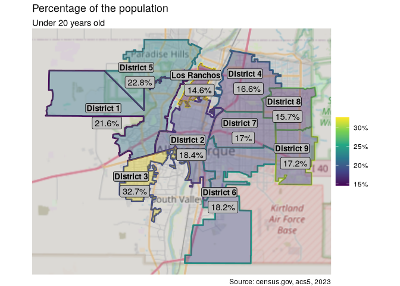

<details class="code-fold">
<summary>Show the code</summary>

``` r
age_sex_dist_sf %>%
  filter(
    district != "Los Ranchos",
    agegroup %in% agegroup[1:5]
  ) %>%
  group_by(district) %>%
  summarise(value = sum(value)) %>%
  mutate(label = scales::comma(value)) %>%
  map_demo(pct = F) +
  labs(subtitle = "Under 20 years old")
```

</details>

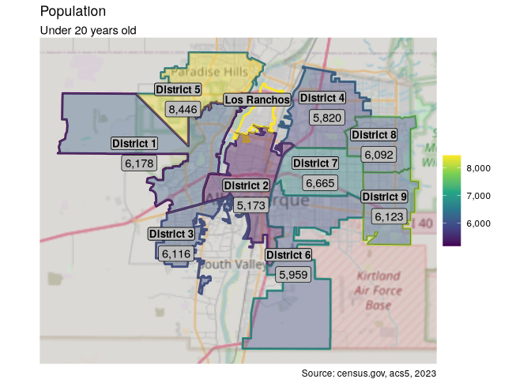

## Race

> [!NOTE]
>
> ### Data preparation
>
> I’ll create the function to clean the race tables. Unlike the former
> data set, the labels need some extra cleanup for plotting purposes.
> Note the conditional block where the `.` is required in the `select`
> statement.
>
> ``` r
> race_labels <- get_labels("B03002")
>
> race_clean <- function(df, area) {
>   df %>%
>     filter(str_detect(label, "_")) %>%
>     separate(label, c("hisp", "race"), sep = "_") %>%
>     {
>       if (area) select(., geoid, hisp, race, value = estimate, area)
>       else select(., hisp, race, value = estimate)
>       
>     } %>%
>     mutate(
>       hisp = if_else(hisp == "Not Hispanic or Latino",
>         "Non-Hispanic", "Hispanic"
>       ),
>       race = str_replace(race, " alone$", ""),
>       race = if_else(str_detect(race, "Two"),
>         "Two or more races", race
>       ),
>       race = if_else(str_detect(race, "Black"),
>         "Black", race
>       ),
>       race = if_else(str_detect(race, "Indian"),
>         "American Indian", race
>       )
>     ) %>%
>     group_by(hisp, race)
> }
> ```
>
> Now I can get and process the data as before.
>
> ``` r
> c(race_us, race_nm) %<-%
>   map2(
>     c("us", "state"),
>     c("US", "New Mexico"),
>     \(geography, region)
>     get_tables(geography, "B03002", race_labels) %>%
>       race_clean(area = FALSE) %>%
>       mutate(region = region)
>   )
>
> race_bern <-
>   get_tables("tract", "B03002", race_labels, geometry = TRUE) %>%
>   st_transform(crs) %>%
>   mutate(area = st_area(.)) %>%
>   race_clean(area = T) %>%
>   mutate(region = "Bernalillo")
>
> race_dist_sf <-
>   race_bern %>%
>   split_dists() %>%
>   select(geoid, district, hisp, race, value = "new_value") %>%
>   mutate(region = "Albuquerque")
>
> race_dist <- st_drop_geometry(race_dist_sf)
> ```
>
> I’ll prepare the datasets for plotting. I’m going to remove two race
> categories for plotting purposes, both with minimal presence in New
> Mexico.
>
> ``` r
> race_compare <-
>   rbind(
>     race_dist %>% select(hisp, race, value, region),
>     race_us, race_nm
>   )
>
> c(race_compare_plt, race_dist_plt) %<-%
>   map(
>     list(race_compare, race_dist),
>     \(x) x %>%
>       filter(race != "Some other race" &
>         race != "Native Hawaiian and Other Pacific Islander")
>   )
> ```

Race is a little complicated. The official racial categories include
White, Black, Asian American, and Native American. Hispanic vs
Non-Hispanic is a separate categorization in the census data. I am
interested in both.

<details class="code-fold">
<summary>Show the code</summary>

``` r
race_compare_plt <-
  race_compare_plt %>%
  mutate(
    region = factor(region, level = c("US", "New Mexico", "Albuquerque"))
  )

race_dist_plt <- race_dist_plt %>%
  filter(district != "Los Ranchos") %>%
  mutate(district = str_replace(district, "District", "Dist"))

race_compare_plt %>%
  compare_plot("race", "region") +
  scale_y_continuous(labels = scales::percent) +
  labs(
    title = "Racial Comparison",
    subtitle = "Albuquerque, State and Country",
    fill = "Selected Races"
  )
```

</details>

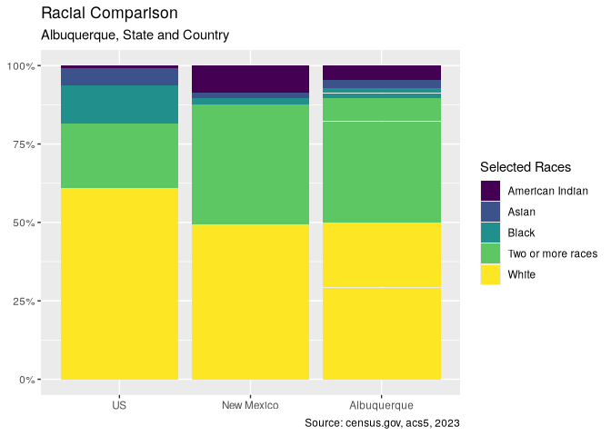

Here we see that New Mexico has few Black and Asian residents, but
unsurprisingly a much larger percentage of Native Americans when
compared to the country as a whole. These differences are somewhat less
in Albuquerque itself. Both have a large percentage of people saying 2
or more races. This could be because, in New Mexico, many Hispanics
self-identify as Spanish or Mexican as well as White, therefore
selecting 2 or more races. It will be interesting to see if districts
with high Hispanic populations also have high “2 or more race”
populations.

<details class="code-fold">
<summary>Show the code</summary>

``` r
race_compare_plt %>%
  compare_plot("hisp", "region") +
  scale_y_continuous(labels = scales::percent) +
  labs(
    title = "Hispanic Comparison",
    subtitle = "Albuquerque, State and Country",
    fill = ""
  )
```

</details>

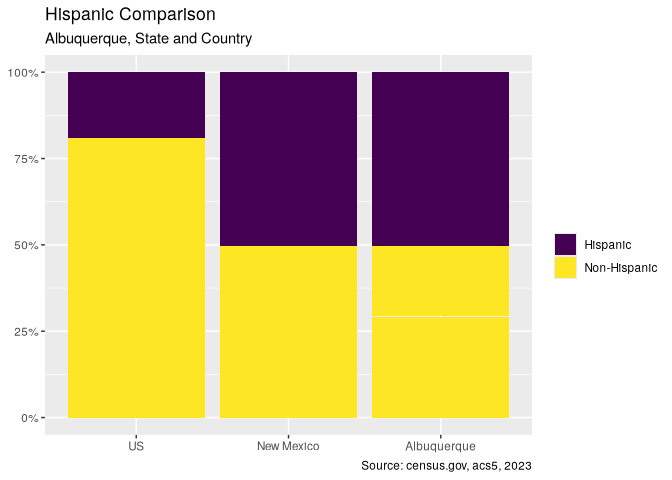

New Mexico has the largest Hispanic population by percentage of any
state in the country, so these results are hardly surprising. The
district breakdown will be more interesting.

<details class="code-fold">
<summary>Show the code</summary>

``` r
p1 <- race_dist_plt %>%
  compare_plot("race", "district") +
  scale_y_continuous(labels = scales::percent) +
  theme(
    axis.text.x = element_text(angle = 45, vjust = 1, hjust = 1),
    legend.position = "none"
  ) +
  labs(
    title = "Racial Comparison by District",
    subtitle = "Percentage",
    caption = ""
  )

p2 <- race_dist_plt %>%
  compare_plot("race", "district", position = "stack") +
  scale_y_continuous(labels = scales::comma) +
  theme(axis.text.x = element_text(angle = 45, vjust = 1, hjust = 1)) +
  labs(
    subtitle = "Population",
    fill = "Selected Races"
  )

p1 + p2
```

</details>

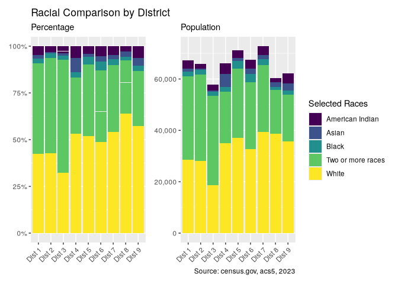

District 4 shows the greatest racial diversity, while district 2 shows
the least. District 3 shows the largest percentage of people claiming
two or more races. Let’s compare Hispanic to non-Hispanic.

<details class="code-fold">
<summary>Show the code</summary>

``` r
p1 <- race_dist_plt %>%
  compare_plot("hisp", "district") +
  scale_y_continuous(labels = scales::percent) +
  theme(
    axis.text.x = element_text(angle = 45, vjust = 1, hjust = 1),
    legend.position = "none"
  ) +
  labs(
    title = "Hispanic Comparison by District",
    subtitle = "Percentage", caption = ""
  )

p2 <- race_dist_plt %>%
  compare_plot("hisp", "district", "stack") +
  scale_y_continuous(labels = scales::comma) +
  theme(
    axis.text.x = element_text(angle = 45, vjust = 1, hjust = 1),
    legend.title = element_blank()
  ) +
  labs(subtitle = "Population")

p1 + p2
```

</details>

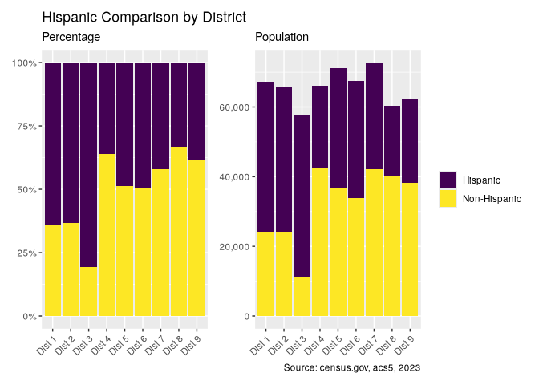

Indeed, there is a high degree of variability across Albuquerque, with
some districts very heavily Hispanic, such as the third district, and
some not, such as the eighth. The high level of Hispanics in district 3,
combined with the fact that this district also has the highest
proportion of those who identify as two more more races, lends support
to my hypothesis that this group are Hispanic Whites. Let’s view this on
a map.

<details class="code-fold">
<summary>Show the code</summary>

``` r
dist_hisp <-
  calculate_dist_percents(
    race_dist,
    race_dist_sf %>%
      filter(hisp == "Hispanic")
  )

dist_hisp %>%
  map_demo() +
  labs(subtitle = "Hispanic")
```

</details>

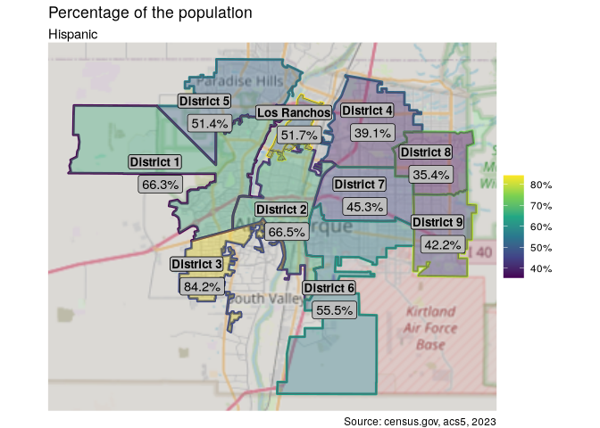

## Education

> [!NOTE]
>
> ### Data preparation
>
> The information provided by `census.gov` contains many groupings, far
> too many for useful analysis. I will consolidate many of the levels
> into smaller groupings, using `case_when`.
>
> ``` r
> edu_labels <- get_labels("B15002")
>
> edu_bern <-
>   get_tables("tract", "B15002", edu_labels, geometry = T) %>%
>   filter(str_detect(label, "_")) %>%
>   separate(label, c("sex", "education"), sep = "_") %>%
>   select(geoid, sex, education, value = estimate) %>%
>   st_transform(crs) %>%
>   mutate(area = st_area(.))
>
> edu_levels_all <- unique(edu_bern$education)
>
> simplify_education <- function(df) {
>   df %>%
>     mutate(
>       education = case_when(
>         education %in% edu_levels_all[1:8]
>         ~ "No HS Diploma",
>         education %in% edu_levels_all[9:11]
>         ~ "High school graduate",
>         TRUE ~ education
>       ),
>       education = factor(education, unique(education))
>     )
> }
>
> edu_bern <- edu_bern %>%
>   simplify_education()
>
> edu_levels <- 
>   c("No HS Diploma", "High school graduate", edu_levels_all[-(1:11)])
>
> c(edu_us, edu_nm) %<-%
>   map2(
>     c("us", "state"),
>     c("US", "New Mexico"),
>     \(geography, region)
>     get_tables(geography, "B15002", edu_labels) %>%
>       filter(str_detect(label, "_")) %>%
>       separate(label, c("sex", "education"), sep = "_") %>%
>       select(geoid, sex, education, value = estimate) %>%
>       simplify_education() %>%
>       mutate(region = region)
>   )
>
> edu_dist_sf <- edu_bern %>%
>   split_dists() %>%
>   select(geoid, district, sex, education, value = "new_value") %>%
>   mutate(region = "Albuquerque")
>
> edu_dist <- st_drop_geometry(edu_dist_sf)
> ```

Finally, I can turn to education. This data represents the educational
attainment level of people 25 or older. As before, I’ll start with a
comparison with national and state data.

<details class="code-fold">
<summary>Show the code</summary>

``` r
p1 <- edu_us %>%
  mf_plot(c("sex", "education"), 2) +
  theme(legend.position = "none") +
  xlab("US")
p2 <- edu_nm %>%
  mf_plot(c("sex", "education"), 2) +
  theme(
    legend.position = "none",
    axis.text.y = element_blank()
  ) +
  xlab("New Mexico")
p3 <- edu_dist %>%
  group_by(sex, education) %>%
  summarise(value = sum(value)) %>%
  mf_plot(c("sex", "education"), pos = 2) +
  theme(
    axis.text.y = element_blank(),
    legend.title = element_blank()
  ) +
  xlab("Albuquerque")

pw <- p1 + p2 + p3
pw + plot_annotation(
  title = "Educational Attainment",
  subtitle = "Age 25 or older",
  caption = "Source: census.gov, acs5, 2023"
)
```

</details>

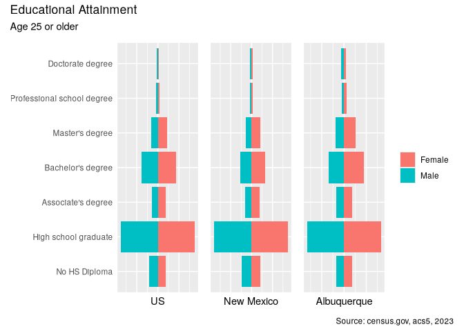

Albuquerque would seem to have proportionally a higher number of people
with college degrees compared to New Mexico, and a higher number of
advanced degrees than the rest of the country.

<details class="code-fold">
<summary>Show the code</summary>

``` r
edu_dist_cmp <- edu_dist %>%
  group_by(sex, education) %>%
  summarise(value = sum(value)) %>%
  mutate(region = "Albuquerque")
edu_compare <- rbind(edu_dist_cmp, edu_nm, edu_us)

edu_compare_table <- edu_compare %>%
  prepare_tables("region", "education") %>%
  mutate(education = factor(education, edu_levels))

edu_compare_table %>%
  print_table(
    group = "education",
    title = "**Comparison of Educational Attainment**",
    subtitle = "Age 25 or older"
  ) %>%
  cols_width(
    education ~ px(190),
    everything() ~ px(110)
  )
```

</details>

<div id="ajufgdbyjz" style="padding-left:0px;padding-right:0px;padding-top:10px;padding-bottom:10px;overflow-x:auto;overflow-y:auto;width:auto;height:auto;">
<style>@import url("https://fonts.googleapis.com/css2?family=Lato:ital,wght@0,100;0,200;0,300;0,400;0,500;0,600;0,700;0,800;0,900;1,100;1,200;1,300;1,400;1,500;1,600;1,700;1,800;1,900&display=swap");
#ajufgdbyjz table {
  font-family: Lato, system-ui, 'Segoe UI', Roboto, Helvetica, Arial, sans-serif, 'Apple Color Emoji', 'Segoe UI Emoji', 'Segoe UI Symbol', 'Noto Color Emoji';
  -webkit-font-smoothing: antialiased;
  -moz-osx-font-smoothing: grayscale;
}
&#10;#ajufgdbyjz thead, #ajufgdbyjz tbody, #ajufgdbyjz tfoot, #ajufgdbyjz tr, #ajufgdbyjz td, #ajufgdbyjz th {
  border-style: none;
}
&#10;#ajufgdbyjz p {
  margin: 0;
  padding: 0;
}
&#10;#ajufgdbyjz .gt_table {
  display: table;
  border-collapse: collapse;
  line-height: normal;
  margin-left: auto;
  margin-right: auto;
  color: #333333;
  font-size: 16px;
  font-weight: normal;
  font-style: normal;
  background-color: #FFFFFF;
  width: auto;
  border-top-style: solid;
  border-top-width: 3px;
  border-top-color: #FFFFFF;
  border-right-style: none;
  border-right-width: 2px;
  border-right-color: #D3D3D3;
  border-bottom-style: solid;
  border-bottom-width: 2px;
  border-bottom-color: #A8A8A8;
  border-left-style: none;
  border-left-width: 2px;
  border-left-color: #D3D3D3;
}
&#10;#ajufgdbyjz .gt_caption {
  padding-top: 4px;
  padding-bottom: 4px;
}
&#10;#ajufgdbyjz .gt_title {
  color: #333333;
  font-size: 24px;
  font-weight: initial;
  padding-top: 4px;
  padding-bottom: 4px;
  padding-left: 5px;
  padding-right: 5px;
  border-bottom-color: #FFFFFF;
  border-bottom-width: 0;
}
&#10;#ajufgdbyjz .gt_subtitle {
  color: #333333;
  font-size: 85%;
  font-weight: initial;
  padding-top: 3px;
  padding-bottom: 5px;
  padding-left: 5px;
  padding-right: 5px;
  border-top-color: #FFFFFF;
  border-top-width: 0;
}
&#10;#ajufgdbyjz .gt_heading {
  background-color: #FFFFFF;
  text-align: center;
  border-bottom-color: #FFFFFF;
  border-left-style: none;
  border-left-width: 1px;
  border-left-color: #D3D3D3;
  border-right-style: none;
  border-right-width: 1px;
  border-right-color: #D3D3D3;
}
&#10;#ajufgdbyjz .gt_bottom_border {
  border-bottom-style: solid;
  border-bottom-width: 2px;
  border-bottom-color: #D3D3D3;
}
&#10;#ajufgdbyjz .gt_col_headings {
  border-top-style: solid;
  border-top-width: 2px;
  border-top-color: #D3D3D3;
  border-bottom-style: solid;
  border-bottom-width: 2px;
  border-bottom-color: #D3D3D3;
  border-left-style: none;
  border-left-width: 1px;
  border-left-color: #D3D3D3;
  border-right-style: none;
  border-right-width: 1px;
  border-right-color: #D3D3D3;
}
&#10;#ajufgdbyjz .gt_col_heading {
  color: #333333;
  background-color: #FFFFFF;
  font-size: 80%;
  font-weight: bolder;
  text-transform: uppercase;
  border-left-style: none;
  border-left-width: 1px;
  border-left-color: #D3D3D3;
  border-right-style: none;
  border-right-width: 1px;
  border-right-color: #D3D3D3;
  vertical-align: bottom;
  padding-top: 5px;
  padding-bottom: 6px;
  padding-left: 5px;
  padding-right: 5px;
  overflow-x: hidden;
}
&#10;#ajufgdbyjz .gt_column_spanner_outer {
  color: #333333;
  background-color: #FFFFFF;
  font-size: 80%;
  font-weight: bolder;
  text-transform: uppercase;
  padding-top: 0;
  padding-bottom: 0;
  padding-left: 4px;
  padding-right: 4px;
}
&#10;#ajufgdbyjz .gt_column_spanner_outer:first-child {
  padding-left: 0;
}
&#10;#ajufgdbyjz .gt_column_spanner_outer:last-child {
  padding-right: 0;
}
&#10;#ajufgdbyjz .gt_column_spanner {
  border-bottom-style: solid;
  border-bottom-width: 2px;
  border-bottom-color: #D3D3D3;
  vertical-align: bottom;
  padding-top: 5px;
  padding-bottom: 5px;
  overflow-x: hidden;
  display: inline-block;
  width: 100%;
}
&#10;#ajufgdbyjz .gt_spanner_row {
  border-bottom-style: hidden;
}
&#10;#ajufgdbyjz .gt_group_heading {
  padding-top: 8px;
  padding-bottom: 8px;
  padding-left: 5px;
  padding-right: 5px;
  color: #333333;
  background-color: #FFFFFF;
  font-size: 80%;
  font-weight: bolder;
  text-transform: uppercase;
  border-top-style: solid;
  border-top-width: 2px;
  border-top-color: #D3D3D3;
  border-bottom-style: solid;
  border-bottom-width: 2px;
  border-bottom-color: #D3D3D3;
  border-left-style: none;
  border-left-width: 1px;
  border-left-color: #D3D3D3;
  border-right-style: none;
  border-right-width: 1px;
  border-right-color: #D3D3D3;
  vertical-align: middle;
  text-align: left;
}
&#10;#ajufgdbyjz .gt_empty_group_heading {
  padding: 0.5px;
  color: #333333;
  background-color: #FFFFFF;
  font-size: 80%;
  font-weight: bolder;
  border-top-style: solid;
  border-top-width: 2px;
  border-top-color: #D3D3D3;
  border-bottom-style: solid;
  border-bottom-width: 2px;
  border-bottom-color: #D3D3D3;
  vertical-align: middle;
}
&#10;#ajufgdbyjz .gt_from_md > :first-child {
  margin-top: 0;
}
&#10;#ajufgdbyjz .gt_from_md > :last-child {
  margin-bottom: 0;
}
&#10;#ajufgdbyjz .gt_row {
  padding-top: 7px;
  padding-bottom: 7px;
  padding-left: 5px;
  padding-right: 5px;
  margin: 10px;
  border-top-style: solid;
  border-top-width: 1px;
  border-top-color: #F6F7F7;
  border-left-style: none;
  border-left-width: 1px;
  border-left-color: #D3D3D3;
  border-right-style: none;
  border-right-width: 1px;
  border-right-color: #D3D3D3;
  vertical-align: middle;
  overflow-x: hidden;
}
&#10;#ajufgdbyjz .gt_stub {
  color: #333333;
  background-color: #FFFFFF;
  font-size: 80%;
  font-weight: bolder;
  text-transform: uppercase;
  border-right-style: solid;
  border-right-width: 2px;
  border-right-color: #D3D3D3;
  padding-left: 5px;
  padding-right: 5px;
}
&#10;#ajufgdbyjz .gt_stub_row_group {
  color: #333333;
  background-color: #FFFFFF;
  font-size: 100%;
  font-weight: initial;
  text-transform: inherit;
  border-right-style: solid;
  border-right-width: 2px;
  border-right-color: #D3D3D3;
  padding-left: 5px;
  padding-right: 5px;
  vertical-align: top;
}
&#10;#ajufgdbyjz .gt_row_group_first td {
  border-top-width: 2px;
}
&#10;#ajufgdbyjz .gt_row_group_first th {
  border-top-width: 2px;
}
&#10;#ajufgdbyjz .gt_summary_row {
  color: #333333;
  background-color: #FFFFFF;
  text-transform: inherit;
  padding-top: 8px;
  padding-bottom: 8px;
  padding-left: 5px;
  padding-right: 5px;
}
&#10;#ajufgdbyjz .gt_first_summary_row {
  border-top-style: solid;
  border-top-color: #D3D3D3;
}
&#10;#ajufgdbyjz .gt_first_summary_row.thick {
  border-top-width: 2px;
}
&#10;#ajufgdbyjz .gt_last_summary_row {
  padding-top: 8px;
  padding-bottom: 8px;
  padding-left: 5px;
  padding-right: 5px;
  border-bottom-style: solid;
  border-bottom-width: 2px;
  border-bottom-color: #D3D3D3;
}
&#10;#ajufgdbyjz .gt_grand_summary_row {
  color: #333333;
  background-color: #FFFFFF;
  text-transform: inherit;
  padding-top: 8px;
  padding-bottom: 8px;
  padding-left: 5px;
  padding-right: 5px;
}
&#10;#ajufgdbyjz .gt_first_grand_summary_row {
  padding-top: 8px;
  padding-bottom: 8px;
  padding-left: 5px;
  padding-right: 5px;
  border-top-style: double;
  border-top-width: 6px;
  border-top-color: #D3D3D3;
}
&#10;#ajufgdbyjz .gt_last_grand_summary_row_top {
  padding-top: 8px;
  padding-bottom: 8px;
  padding-left: 5px;
  padding-right: 5px;
  border-bottom-style: double;
  border-bottom-width: 6px;
  border-bottom-color: #D3D3D3;
}
&#10;#ajufgdbyjz .gt_striped {
  background-color: #FAFAFA;
}
&#10;#ajufgdbyjz .gt_table_body {
  border-top-style: solid;
  border-top-width: 2px;
  border-top-color: #D3D3D3;
  border-bottom-style: solid;
  border-bottom-width: 2px;
  border-bottom-color: #D3D3D3;
}
&#10;#ajufgdbyjz .gt_footnotes {
  color: #333333;
  background-color: #FFFFFF;
  border-bottom-style: none;
  border-bottom-width: 2px;
  border-bottom-color: #D3D3D3;
  border-left-style: none;
  border-left-width: 2px;
  border-left-color: #D3D3D3;
  border-right-style: none;
  border-right-width: 2px;
  border-right-color: #D3D3D3;
}
&#10;#ajufgdbyjz .gt_footnote {
  margin: 0px;
  font-size: 90%;
  padding-top: 4px;
  padding-bottom: 4px;
  padding-left: 5px;
  padding-right: 5px;
}
&#10;#ajufgdbyjz .gt_sourcenotes {
  color: #333333;
  background-color: #FFFFFF;
  border-bottom-style: none;
  border-bottom-width: 2px;
  border-bottom-color: #D3D3D3;
  border-left-style: none;
  border-left-width: 2px;
  border-left-color: #D3D3D3;
  border-right-style: none;
  border-right-width: 2px;
  border-right-color: #D3D3D3;
}
&#10;#ajufgdbyjz .gt_sourcenote {
  font-size: 12px;
  padding-top: 4px;
  padding-bottom: 4px;
  padding-left: 5px;
  padding-right: 5px;
}
&#10;#ajufgdbyjz .gt_left {
  text-align: left;
}
&#10;#ajufgdbyjz .gt_center {
  text-align: center;
}
&#10;#ajufgdbyjz .gt_right {
  text-align: right;
  font-variant-numeric: tabular-nums;
}
&#10;#ajufgdbyjz .gt_font_normal {
  font-weight: normal;
}
&#10;#ajufgdbyjz .gt_font_bold {
  font-weight: bold;
}
&#10;#ajufgdbyjz .gt_font_italic {
  font-style: italic;
}
&#10;#ajufgdbyjz .gt_super {
  font-size: 65%;
}
&#10;#ajufgdbyjz .gt_footnote_marks {
  font-size: 75%;
  vertical-align: 0.4em;
  position: initial;
}
&#10;#ajufgdbyjz .gt_asterisk {
  font-size: 100%;
  vertical-align: 0;
}
&#10;#ajufgdbyjz .gt_indent_1 {
  text-indent: 5px;
}
&#10;#ajufgdbyjz .gt_indent_2 {
  text-indent: 10px;
}
&#10;#ajufgdbyjz .gt_indent_3 {
  text-indent: 15px;
}
&#10;#ajufgdbyjz .gt_indent_4 {
  text-indent: 20px;
}
&#10;#ajufgdbyjz .gt_indent_5 {
  text-indent: 25px;
}
&#10;#ajufgdbyjz .katex-display {
  display: inline-flex !important;
  margin-bottom: 0.75em !important;
}
&#10;#ajufgdbyjz div.Reactable > div.rt-table > div.rt-thead > div.rt-tr.rt-tr-group-header > div.rt-th-group:after {
  height: 0px !important;
}
</style>

| <strong>Comparison of Educational Attainment</strong> |  |  |  |
|----|----|----|----|
| Age 25 or older |  |  |  |
|  | Albuquerque | New Mexico | US |
| No HS Diploma | 9.2% | 12.3% | 10.6% |
| High school graduate | 43.4% | 48.3% | 45.6% |
| Associate's degree | 9.3% | 9.2% | 8.8% |
| Bachelor's degree | 20.7% | 16.6% | 21.3% |
| Master's degree | 11.9% | 9.6% | 9.8% |
| Professional school degree | 2.7% | 2.0% | 2.3% |
| Doctorate degree | 2.8% | 2.1% | 1.6% |
| Source: census.gov, acs5, 2023 |  |  |  |

</div>

Indeed, Albuquerque does have proportionally more advanced degrees than
the nation as a whole.

<details class="code-fold">
<summary>Show the code</summary>

``` r
edu_dist %>%
  filter(district != "Los Ranchos") %>%
  mf_plot(c("district", "sex", "education"), 3) +
  facet_wrap(~district) +
  labs(
    x = "Population",
    title = "Educational attainment in Albuquerque",
    subtitle = "Age 25 or older"
  ) +
  theme(axis.text.y = element_text(size = 6))
```

</details>

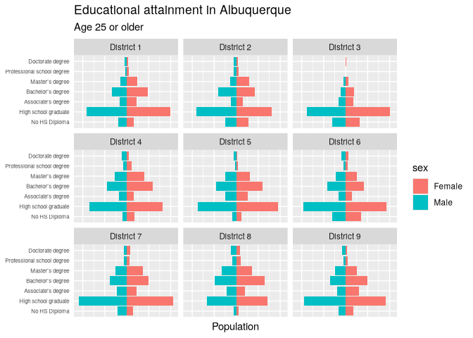

Again, we see significant variation between districts, District 3
notably devoid of nearly any professional or doctoral degrees. On the
other hand, almost all of District 8 has at least completed high school.

<details class="code-fold">
<summary>Show the code</summary>

``` r
edu_dist_plt <- edu_dist %>%
  filter(district != "Los Ranchos") %>%
  mutate(
    education = fct_rev(education),
    district = str_replace(district, "District", "Dist")
  )


p1 <- edu_dist_plt %>%
  compare_plot("education", "district") +
  scale_y_continuous(labels = scales::percent) +
  theme(
    axis.text.x = element_text(angle = 45, vjust = 1, hjust = 1),
    legend.position = "none"
  ) +
  labs(
    title = "Educational Attainment by District (25 or older)",
    subtitle = "Percentage",
    caption = ""
  )

p2 <- edu_dist_plt %>%
  compare_plot("education", "district", position = "stack") +
  scale_y_continuous(labels = scales::comma) +
  theme(
    axis.text.x = element_text(angle = 45, vjust = 1, hjust = 1)
  ) +
  labs(
    subtitle = "Population",
    fill = "",
    caption = source
  )

p1 + p2
```

</details>

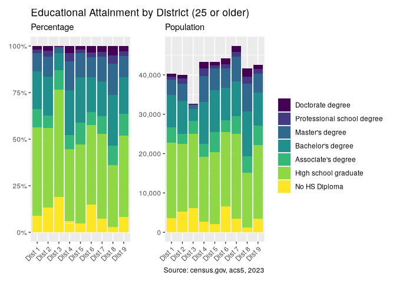

<details class="code-fold">
<summary>Show the code</summary>

``` r
edu_dist_table <- edu_dist %>%
  filter(district != "Los Ranchos") %>%
  prepare_tables("district", "education") %>%
  rename_with(~ gsub("District", "Dist", .x))

edu_dist_table %>%
  print_table(
    group = "education",
    title = "**Comparison of Educational Attainment**",
    subtitle = "Age 25 or older"
  )
```

</details>

<div id="ljjxxsfagn" style="padding-left:0px;padding-right:0px;padding-top:10px;padding-bottom:10px;overflow-x:auto;overflow-y:auto;width:auto;height:auto;">
<style>@import url("https://fonts.googleapis.com/css2?family=Lato:ital,wght@0,100;0,200;0,300;0,400;0,500;0,600;0,700;0,800;0,900;1,100;1,200;1,300;1,400;1,500;1,600;1,700;1,800;1,900&display=swap");
#ljjxxsfagn table {
  font-family: Lato, system-ui, 'Segoe UI', Roboto, Helvetica, Arial, sans-serif, 'Apple Color Emoji', 'Segoe UI Emoji', 'Segoe UI Symbol', 'Noto Color Emoji';
  -webkit-font-smoothing: antialiased;
  -moz-osx-font-smoothing: grayscale;
}
&#10;#ljjxxsfagn thead, #ljjxxsfagn tbody, #ljjxxsfagn tfoot, #ljjxxsfagn tr, #ljjxxsfagn td, #ljjxxsfagn th {
  border-style: none;
}
&#10;#ljjxxsfagn p {
  margin: 0;
  padding: 0;
}
&#10;#ljjxxsfagn .gt_table {
  display: table;
  border-collapse: collapse;
  line-height: normal;
  margin-left: auto;
  margin-right: auto;
  color: #333333;
  font-size: 16px;
  font-weight: normal;
  font-style: normal;
  background-color: #FFFFFF;
  width: auto;
  border-top-style: solid;
  border-top-width: 3px;
  border-top-color: #FFFFFF;
  border-right-style: none;
  border-right-width: 2px;
  border-right-color: #D3D3D3;
  border-bottom-style: solid;
  border-bottom-width: 2px;
  border-bottom-color: #A8A8A8;
  border-left-style: none;
  border-left-width: 2px;
  border-left-color: #D3D3D3;
}
&#10;#ljjxxsfagn .gt_caption {
  padding-top: 4px;
  padding-bottom: 4px;
}
&#10;#ljjxxsfagn .gt_title {
  color: #333333;
  font-size: 24px;
  font-weight: initial;
  padding-top: 4px;
  padding-bottom: 4px;
  padding-left: 5px;
  padding-right: 5px;
  border-bottom-color: #FFFFFF;
  border-bottom-width: 0;
}
&#10;#ljjxxsfagn .gt_subtitle {
  color: #333333;
  font-size: 85%;
  font-weight: initial;
  padding-top: 3px;
  padding-bottom: 5px;
  padding-left: 5px;
  padding-right: 5px;
  border-top-color: #FFFFFF;
  border-top-width: 0;
}
&#10;#ljjxxsfagn .gt_heading {
  background-color: #FFFFFF;
  text-align: center;
  border-bottom-color: #FFFFFF;
  border-left-style: none;
  border-left-width: 1px;
  border-left-color: #D3D3D3;
  border-right-style: none;
  border-right-width: 1px;
  border-right-color: #D3D3D3;
}
&#10;#ljjxxsfagn .gt_bottom_border {
  border-bottom-style: solid;
  border-bottom-width: 2px;
  border-bottom-color: #D3D3D3;
}
&#10;#ljjxxsfagn .gt_col_headings {
  border-top-style: solid;
  border-top-width: 2px;
  border-top-color: #D3D3D3;
  border-bottom-style: solid;
  border-bottom-width: 2px;
  border-bottom-color: #D3D3D3;
  border-left-style: none;
  border-left-width: 1px;
  border-left-color: #D3D3D3;
  border-right-style: none;
  border-right-width: 1px;
  border-right-color: #D3D3D3;
}
&#10;#ljjxxsfagn .gt_col_heading {
  color: #333333;
  background-color: #FFFFFF;
  font-size: 80%;
  font-weight: bolder;
  text-transform: uppercase;
  border-left-style: none;
  border-left-width: 1px;
  border-left-color: #D3D3D3;
  border-right-style: none;
  border-right-width: 1px;
  border-right-color: #D3D3D3;
  vertical-align: bottom;
  padding-top: 5px;
  padding-bottom: 6px;
  padding-left: 5px;
  padding-right: 5px;
  overflow-x: hidden;
}
&#10;#ljjxxsfagn .gt_column_spanner_outer {
  color: #333333;
  background-color: #FFFFFF;
  font-size: 80%;
  font-weight: bolder;
  text-transform: uppercase;
  padding-top: 0;
  padding-bottom: 0;
  padding-left: 4px;
  padding-right: 4px;
}
&#10;#ljjxxsfagn .gt_column_spanner_outer:first-child {
  padding-left: 0;
}
&#10;#ljjxxsfagn .gt_column_spanner_outer:last-child {
  padding-right: 0;
}
&#10;#ljjxxsfagn .gt_column_spanner {
  border-bottom-style: solid;
  border-bottom-width: 2px;
  border-bottom-color: #D3D3D3;
  vertical-align: bottom;
  padding-top: 5px;
  padding-bottom: 5px;
  overflow-x: hidden;
  display: inline-block;
  width: 100%;
}
&#10;#ljjxxsfagn .gt_spanner_row {
  border-bottom-style: hidden;
}
&#10;#ljjxxsfagn .gt_group_heading {
  padding-top: 8px;
  padding-bottom: 8px;
  padding-left: 5px;
  padding-right: 5px;
  color: #333333;
  background-color: #FFFFFF;
  font-size: 80%;
  font-weight: bolder;
  text-transform: uppercase;
  border-top-style: solid;
  border-top-width: 2px;
  border-top-color: #D3D3D3;
  border-bottom-style: solid;
  border-bottom-width: 2px;
  border-bottom-color: #D3D3D3;
  border-left-style: none;
  border-left-width: 1px;
  border-left-color: #D3D3D3;
  border-right-style: none;
  border-right-width: 1px;
  border-right-color: #D3D3D3;
  vertical-align: middle;
  text-align: left;
}
&#10;#ljjxxsfagn .gt_empty_group_heading {
  padding: 0.5px;
  color: #333333;
  background-color: #FFFFFF;
  font-size: 80%;
  font-weight: bolder;
  border-top-style: solid;
  border-top-width: 2px;
  border-top-color: #D3D3D3;
  border-bottom-style: solid;
  border-bottom-width: 2px;
  border-bottom-color: #D3D3D3;
  vertical-align: middle;
}
&#10;#ljjxxsfagn .gt_from_md > :first-child {
  margin-top: 0;
}
&#10;#ljjxxsfagn .gt_from_md > :last-child {
  margin-bottom: 0;
}
&#10;#ljjxxsfagn .gt_row {
  padding-top: 7px;
  padding-bottom: 7px;
  padding-left: 5px;
  padding-right: 5px;
  margin: 10px;
  border-top-style: solid;
  border-top-width: 1px;
  border-top-color: #F6F7F7;
  border-left-style: none;
  border-left-width: 1px;
  border-left-color: #D3D3D3;
  border-right-style: none;
  border-right-width: 1px;
  border-right-color: #D3D3D3;
  vertical-align: middle;
  overflow-x: hidden;
}
&#10;#ljjxxsfagn .gt_stub {
  color: #333333;
  background-color: #FFFFFF;
  font-size: 80%;
  font-weight: bolder;
  text-transform: uppercase;
  border-right-style: solid;
  border-right-width: 2px;
  border-right-color: #D3D3D3;
  padding-left: 5px;
  padding-right: 5px;
}
&#10;#ljjxxsfagn .gt_stub_row_group {
  color: #333333;
  background-color: #FFFFFF;
  font-size: 100%;
  font-weight: initial;
  text-transform: inherit;
  border-right-style: solid;
  border-right-width: 2px;
  border-right-color: #D3D3D3;
  padding-left: 5px;
  padding-right: 5px;
  vertical-align: top;
}
&#10;#ljjxxsfagn .gt_row_group_first td {
  border-top-width: 2px;
}
&#10;#ljjxxsfagn .gt_row_group_first th {
  border-top-width: 2px;
}
&#10;#ljjxxsfagn .gt_summary_row {
  color: #333333;
  background-color: #FFFFFF;
  text-transform: inherit;
  padding-top: 8px;
  padding-bottom: 8px;
  padding-left: 5px;
  padding-right: 5px;
}
&#10;#ljjxxsfagn .gt_first_summary_row {
  border-top-style: solid;
  border-top-color: #D3D3D3;
}
&#10;#ljjxxsfagn .gt_first_summary_row.thick {
  border-top-width: 2px;
}
&#10;#ljjxxsfagn .gt_last_summary_row {
  padding-top: 8px;
  padding-bottom: 8px;
  padding-left: 5px;
  padding-right: 5px;
  border-bottom-style: solid;
  border-bottom-width: 2px;
  border-bottom-color: #D3D3D3;
}
&#10;#ljjxxsfagn .gt_grand_summary_row {
  color: #333333;
  background-color: #FFFFFF;
  text-transform: inherit;
  padding-top: 8px;
  padding-bottom: 8px;
  padding-left: 5px;
  padding-right: 5px;
}
&#10;#ljjxxsfagn .gt_first_grand_summary_row {
  padding-top: 8px;
  padding-bottom: 8px;
  padding-left: 5px;
  padding-right: 5px;
  border-top-style: double;
  border-top-width: 6px;
  border-top-color: #D3D3D3;
}
&#10;#ljjxxsfagn .gt_last_grand_summary_row_top {
  padding-top: 8px;
  padding-bottom: 8px;
  padding-left: 5px;
  padding-right: 5px;
  border-bottom-style: double;
  border-bottom-width: 6px;
  border-bottom-color: #D3D3D3;
}
&#10;#ljjxxsfagn .gt_striped {
  background-color: #FAFAFA;
}
&#10;#ljjxxsfagn .gt_table_body {
  border-top-style: solid;
  border-top-width: 2px;
  border-top-color: #D3D3D3;
  border-bottom-style: solid;
  border-bottom-width: 2px;
  border-bottom-color: #D3D3D3;
}
&#10;#ljjxxsfagn .gt_footnotes {
  color: #333333;
  background-color: #FFFFFF;
  border-bottom-style: none;
  border-bottom-width: 2px;
  border-bottom-color: #D3D3D3;
  border-left-style: none;
  border-left-width: 2px;
  border-left-color: #D3D3D3;
  border-right-style: none;
  border-right-width: 2px;
  border-right-color: #D3D3D3;
}
&#10;#ljjxxsfagn .gt_footnote {
  margin: 0px;
  font-size: 90%;
  padding-top: 4px;
  padding-bottom: 4px;
  padding-left: 5px;
  padding-right: 5px;
}
&#10;#ljjxxsfagn .gt_sourcenotes {
  color: #333333;
  background-color: #FFFFFF;
  border-bottom-style: none;
  border-bottom-width: 2px;
  border-bottom-color: #D3D3D3;
  border-left-style: none;
  border-left-width: 2px;
  border-left-color: #D3D3D3;
  border-right-style: none;
  border-right-width: 2px;
  border-right-color: #D3D3D3;
}
&#10;#ljjxxsfagn .gt_sourcenote {
  font-size: 12px;
  padding-top: 4px;
  padding-bottom: 4px;
  padding-left: 5px;
  padding-right: 5px;
}
&#10;#ljjxxsfagn .gt_left {
  text-align: left;
}
&#10;#ljjxxsfagn .gt_center {
  text-align: center;
}
&#10;#ljjxxsfagn .gt_right {
  text-align: right;
  font-variant-numeric: tabular-nums;
}
&#10;#ljjxxsfagn .gt_font_normal {
  font-weight: normal;
}
&#10;#ljjxxsfagn .gt_font_bold {
  font-weight: bold;
}
&#10;#ljjxxsfagn .gt_font_italic {
  font-style: italic;
}
&#10;#ljjxxsfagn .gt_super {
  font-size: 65%;
}
&#10;#ljjxxsfagn .gt_footnote_marks {
  font-size: 75%;
  vertical-align: 0.4em;
  position: initial;
}
&#10;#ljjxxsfagn .gt_asterisk {
  font-size: 100%;
  vertical-align: 0;
}
&#10;#ljjxxsfagn .gt_indent_1 {
  text-indent: 5px;
}
&#10;#ljjxxsfagn .gt_indent_2 {
  text-indent: 10px;
}
&#10;#ljjxxsfagn .gt_indent_3 {
  text-indent: 15px;
}
&#10;#ljjxxsfagn .gt_indent_4 {
  text-indent: 20px;
}
&#10;#ljjxxsfagn .gt_indent_5 {
  text-indent: 25px;
}
&#10;#ljjxxsfagn .katex-display {
  display: inline-flex !important;
  margin-bottom: 0.75em !important;
}
&#10;#ljjxxsfagn div.Reactable > div.rt-table > div.rt-thead > div.rt-tr.rt-tr-group-header > div.rt-th-group:after {
  height: 0px !important;
}
</style>

| <strong>Comparison of Educational Attainment</strong> |  |  |  |  |  |  |  |  |  |
|----|----|----|----|----|----|----|----|----|----|
| Age 25 or older |  |  |  |  |  |  |  |  |  |
|  | Dist 1 | Dist 2 | Dist 3 | Dist 4 | Dist 5 | Dist 6 | Dist 7 | Dist 8 | Dist 9 |
| No HS Diploma | 8.9% | 13.2% | 19.1% | 6.2% | 4.8% | 14.9% | 7.3% | 2.9% | 8.2% |
| High school graduate | 47.5% | 42.8% | 57.6% | 38.3% | 42.3% | 42.6% | 45.6% | 33.4% | 43.7% |
| Associate's degree | 9.6% | 6.6% | 10.3% | 7.6% | 11.8% | 6.9% | 9.3% | 10.3% | 11.7% |
| Bachelor's degree | 20.5% | 20.9% | 9.1% | 24.3% | 24.4% | 18.7% | 18.9% | 27.3% | 19.8% |
| Master's degree | 9.9% | 10.9% | 3.3% | 15.5% | 13.0% | 11.0% | 13.1% | 16.8% | 11.3% |
| Professional school degree | 1.9% | 3.1% | 0.2% | 4.3% | 1.8% | 2.4% | 2.8% | 4.4% | 2.6% |
| Doctorate degree | 1.8% | 2.5% | 0.4% | 3.8% | 1.9% | 3.6% | 3.1% | 5.1% | 2.7% |
| Source: census.gov, acs5, 2023 |  |  |  |  |  |  |  |  |  |

</div>

I would like to see where those without High School Diplomas live.

<details class="code-fold">
<summary>Show the code</summary>

``` r
edu_lt_hs <-
  calculate_dist_percents(
    edu_dist,
    edu_dist_sf %>%
      filter(education == edu_levels[1])
  )

edu_lt_hs %>%
  map_demo() +
  labs(subtitle = "No High School Diploma")
```

</details>

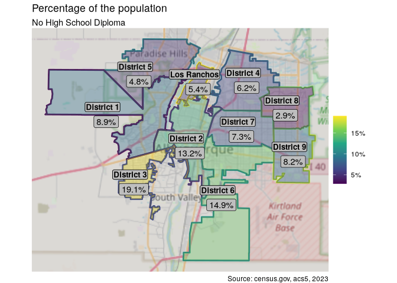

<details class="code-fold">
<summary>Show the code</summary>

``` r
edu_dist_sf %>%
  filter(district != "Los Ranchos",
         education == edu_levels[1]) %>%
  group_by(district) %>% 
  summarise(value = sum(value)) %>% 
  mutate(label = scales::comma(value)) %>%
  map_demo(pct = F) +
  labs(subtitle = "No High School Diploma")
```

</details>

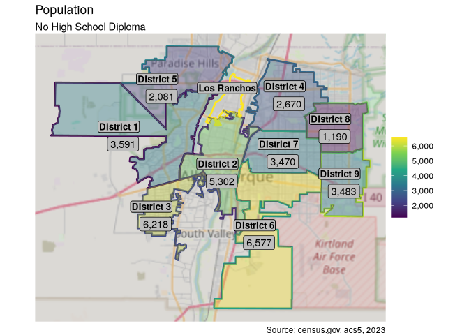

Both by percentage and by total, the southern districts of Albuquerque
have many more people without diplomas than the rest. It seems that the
further north you go, the more people with at least a diploma.

Let’s see where the people with advanced degrees live.

<details class="code-fold">
<summary>Show the code</summary>

``` r
edu_adv_deg <-
  calculate_dist_percents(edu_dist, edu_dist_sf %>%
  filter(education %in% edu_levels[5:7]))

edu_adv_deg %>%
  map_demo() +
  labs(subtitle = "Advanced Degrees")
```

</details>

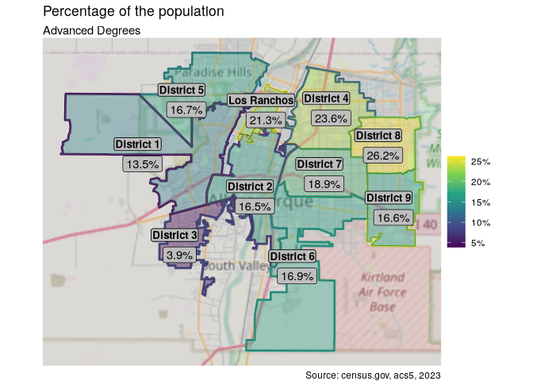

<details class="code-fold">
<summary>Show the code</summary>

``` r
edu_dist_sf %>%
  filter(district != "Los Ranchos",
         education %in% edu_levels[5:7]) %>%
  group_by(district) %>% 
  summarise(value = sum(value)) %>% 
  mutate(label = scales::comma(value)) %>%
  map_demo(pct = F) +
  labs(subtitle = "Advanced Degrees")
```

</details>

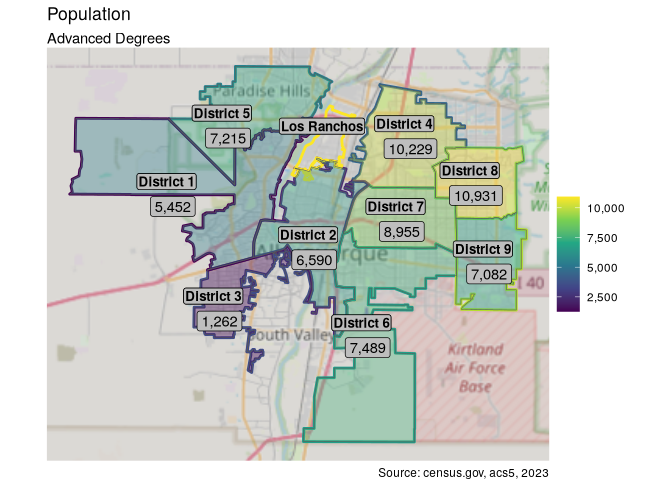

As we’ve seen before, there is extreme variability here. The differences
between District 3 and District 8 are particularly stark, and in this
case at least, represent the extremes of variability.

# Conclusion

All cities have neighborhoods which are very different from one another
demographically and economically. Whether the amount of variability we
saw is “normal” is one question. The next step for me is to look at the
economic indicators such as income, property values, rent and
inequality, and see what correlation may exist between these variables
and the demographic information gathered here.

I have many data sets that I want to save into two files for future use.
For the US and New Mexico data, I can use R’s native format, but for the
county and district information, which are `sf` objects, I will use
multiple layers in a `gpkg` format file. To make this easy, I can use
`walk` and `walk2`. These functions work just like the `map` functions,
except that they don’t return anything useful. They are used only for
“side effects” (a term from functional programming) such as reading,
writing, or printing. Here, I’ll nest a `map` function within `walk2`.

``` r
save(age_sex_us, edu_us, race_us,
    age_sex_nm, edu_nm, race_nm,
    file = "data/us_nm_demographics.rda")

data_sets <- c(
  "age_sex_bern", "edu_bern", "race_bern",
  "age_sex_dist_sf", "edu_dist_sf", "race_dist_sf", "council_dists"
)

walk2(
  map(data_sets, \(x) get(x)),
  data_sets,
  \(df, level) st_write(df, "data/abq_demographics.gpkg",
    layer = level, append = F
  )
)
```
