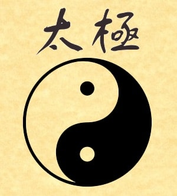

氣	_qì_
陰陽	_yīn yáng_	yin and yang
鹹 _xián_ salted

# The _qi_ of winter

::: {.callout appearance="minimal"}

"During the winter months, all things in nature wither, hide, return home, and enter a resting period."

  -- 黃帝 內經 _Huáng dì nèi jīng_ (The Yellow Emporer's Internal Classic) [@Ni_1995, pp. 6]
:::

The _nei jing_ advises adequate rest and avoidance of strenuous activity. Lack of attention to these practices can result in weakness, stiffness and pain in the bones, tendons and ligaments when spring arrives.

Each season has its own _qi_, its own "nature" and properties. Each season has health implications from the perspective of Chinese Medicine, including both risks and opportunities. Chinese Medicine describes preventative and therapeutic measures appropriate for the time. The therapeutic measures for addressing serious conditions require extensive knowledge and training, but preventative ones, and even treatment of uncomplicated disorders typical of a season, can often be done at home by anyone, as they are primarily related to diet and activity, and don't involve obscure herbs or challenging exercises, nor do they bring health risks of their own.

Chinese Medicine comprises five branches: acupuncture, herbal therapy, _tui na_, (Chinese massage therapy), _qi gong_ (meditation which usually incorporates movement), and food therapy. Fortunately, the latter two can be done at home, so you can take charge of your own health.

_Qi_ in this sense is best understood as simply the "nature" of winter. As always, we begin with _yin_ and _yang_. In Chinese philosophy, _yin_ and _yang_  is not simplistic dualism. These terms describe interdependent relationships and characteristics. Nothing is purely _yin_ or purely _yang_. There is _yin_ in _yang_ and _vice versa_, they "feed" off each other, and one can transform into the other. A close inspection of the traditional _tai ji_ depiction of _yin_ and _yang_ demonstrates this relationship.

A lot of human activities are naturally oriented towards the _qi_ of winter. In business it is the time of doing inventory, taking stock of your situation. Further, it is the time of setting out a budget, the plans for the future year. For an individual, it is time to take stock of the past year, and consider their "purpose" for the coming year.

::: {style="float: right; width: 40%; margin-left: 10px;"}

:::

., and the beginning of analysis is identifying and describing those relationships. Winter is the most _yin_ time of the year. It is the coldest and darkest time of the year, both _yin_ qualities. The sun is weakest, providing the earth with little energy. The earth rests, holding the seeds, absorbing and preserving moisture, all aspects of _yin_. But there is _yang_ within, for even in deep winter there is activity. In fact, according to Chinese Medicine, death itself is the separation of _yin_ and _yang_. And, being at it's weakest, it is particularly important that it be tended and kept warm, in the same sense that drinking fluids is important in the hot summer.

_Yin_ is nourishing, consolidating and preserving. From a medical perspective, anatomy could be  considered _yin_ and physiology _yang_.

_Yin_ moves downward and inward, and life retreats below the surface of the Earth, where it bides the resurgence of _yang_ in the spring. During this time, the _Kidneys_ must be kept warm and nourished. The hearth must be tended with wood, while the kettle of soup boils the roots, beans, seeds, and meat in a stew seasoned with the spices that warm the _yang_.

For people, winter was traditionally a time of relative rest and inactivity. The winter provided time for reflection, contemplation, and making of plans for the coming year. It was a time to gather energy for the coming year, It was also a good time to procreate, providing pleasure, warmth and exercise in an otherwise dull time of year.  While people "socialized", and indeed winter brings many important festivals, daily social interaction is much less, and more focused inwardly on "family".
Each season has its own _qi_, its own "nature" and properties. Each season has health implications from the perspective of Chinese Medicine, including both risks and opportunities. Chinese Medicine describes preventative and therapeutic measures appropriate for the time. The therapeutic measures for addressing serious conditions require extensive knowledge and training, but preventative ones, and even treatment of uncomplicated disorders typical of a season, can often be done at home by anyone, as they are primarily related to diet and activity, and common disorders can be addressed with herbs and formulas which are readily available. They don't involve obscure, potentially harmful herbs or challenging exercises, nor do they bring health risks of their own.

_Yin_ and _yang_ only exist in relation to each other. Everything is a mix of the two. They can be balanced, one can be weak or strong, and they can transform from one into the other. The _qi_ of winter is cold, which is _yin_. There is still a _yang_  aspect to winter, it is just greatly diminished compared to _yin_. Seasonally, _yang_ is weakest in the middle of winter, and _yin_ is strongest. Over the course of the next six months, the _yin_ of winter gradually transforms into the _yang_ of summer. 

The _qi_ of winter is, of course, cold. But that's only the beginning. The word _qi_ is flexible, and its meaning depends on context, but here you can think of it as meaning the _nature_ of winter. Beyond cold, winter brings water, as winter storms replace the dryness of autumn. Winter brings darkness, too, as the sun recedes southward (or northward) and drops lower in the sky, leaving more northerly (or southerly) regions with few hours of light and many of dark. 

# Of Salt and Water

FIX:Find quotes from other religions
In the beginning were the primoridial waters. Not only in the religions which believe in the Old Testament, but all over the world, in both extant and extinct religions, the origin of existence is nearly always associated with an endless ocean, out of which the earth, and life itself, emerged.

The Chinese word for sea or ocean is 大海	_dà hǎi_. _Hǎi_ contains the characters for mother 母 mǔ mother and 水 _shuǐ_ water.

In modern biology, the earliest fossils have been found in the oceans, (and where oceans used to exist). The most promising hypotheses of biogenesis, the origin of life, center on areas of the ocean floor in which cracks in the earth's surface allows the volcanic heat of the Earth's core to heat the salt water.

The amniotic fluid in early preganancy is almost entirely water filled with electrolytes, ie. salt water. We begin life in the medium of salt water, and when we emerge from this "ocean", we carry the salt water as the primary component of our bodies.

# The Kidney

## Physiological

This is the image of the Kidneys (腎	shèn). The Kidneys are the foundation, the origin of an individual's existence. The element of the Kidney is water, and the flavor is salt. Unique among the internal organs, the Kidneys are two organs in one, because the Kidneys are also associated with fire. Fire is the natural element of the Heart and its fire is the _imperial fire_. But there is a special fire associated with the Kidneys, called the _ministerial fire_, or the the _mìng mén_ (命門) fire, which is contained in the Kidney. Life can only begin when yang enters yin, when fire steams water. The _yang_ of _ming men_ reacts with _yin_ salt water of the Kidney to create what is sometimes called the moving qi between the Kidneys, or simply life.

The Kidney System is said to be the root of the bodies *yin* and *yang*. It is also said to be two organs, not one. It contains the *jing*, the essence, which is inherited from our parents, and can be represented by our DNA and RNA. It also contains the *ming men* fire, the active principle which interacts with the essence to create our beings. The Kindeys govern pre-natal and post-natal development from infancy to death. The Kidneys are responsible for bones, and the marrow within, giving it a role in the production of blood. Like the physiological kidney, the Kidney controls the electrolyte balance in our bodies.

While the last point seems natural, from a Western perspective, most of the others seem odd. The Kidneys should be understood to comprise the adrenal glands as well. The concept of marrow extends to both the spine and the cranium, therefore encompassing the brain and the central nervous system. With all of these in hand, the Kidney controls many of the body's hormones.

Given the Kidneys role as the physiological root of the body, these associations are ideal. Between 50-75% of body weight is water, and a further 12-15% is from bones. More interestingly, we can said to be primarily composed of salt water! Salt in the diet promotes the retention of fluids.

In Chinese Medicine we have only five organ systems, and the _Kidney_ system incorporates not only the urinary system and adrenal glands, but the reproductive system and neurological systems as well. The _Kidney_ governs the life cycle from conception to death. It is called the "physiological root of the body's _yin_ and _yang_", and when these are exhausted, death occurs.

The _Kidneys_ are associated with the bones, the "deepest" structural part of the body. It is associated with the bone marrow, and therefore important in the production of blood. It is also associated with something simply called _marrow_, which essentially denotes neurological tissue and nerve cells. The brain is referred to as the _Sea of Marrow_.

The _Kidney_ stores something which is called the _jing_, which is usually translated as "essence". Your _jing_ originally comes from your parents, and certainly encompasses DNA. The _yang_ counterpart of the _jing_ is called _yuan qi_, or source _qi_. This will be important when we consider the psychology later on. 

The fire, the _yang_ (_yang_ within _yin_) of the _Kidneys_, is called the _ming men_ fire, which translates somewhat unhelpfully as the fire of the "life gate". It is the animating force, the RNA, enzymes, and membranes which make use of the DNA "library" to generate life from inanimate substance. Critically, all of this activity happens in water, and modern challenges to the gene-centric approach of standard biology such as those proposed by Denis Noble, who emphasizes the importance of these other substances. In this environment, a living organism is capable of generating novel proteins not encoded for in the DNA. Chinese Medicine allows that the _jing_ 精	jīng	essence be supplemented through life.

## Psychological

"The kidneys are associated with the ears, the color black, fear and fright, and the sound of moaning. While fear and fright will damage the kidneys, understanding, logic, and rational thinking will enable one to defeat the fright." [@Ni_1995, pp. 21]

rom a psychological or spiritual perspective, the _Kidneys_ contain the _zhi_, which is usually translated as the "will". This can be understood as the "will to live", and is related to one's sense of purpose, and to one's ability to create and construct new things, ideas, and even one's own _self_. This foundational sense will be "activated" the energy of the _Liver_ and expressed through the _Heart_. A weak _zhi_ can lead to depression, poor health, and even self-destructive activity.

# Eating in Winter

"(T)he massive glaciers and deep dark seas give rise to the coldness and a salty taste from the ocean. The salty taste stimulates the kidney and nourishes the bones...In harmony it provides quietude but in extremes it causes great freezes and hailstorms that destroy." [@Ni_1995, pp. 244]

## Specific Foods

Of course, nature being what it is, the best foods are those which we naturally store for the winter. This includes root crops, but perhaps more importantly nuts and seeds. For those in coastal areas, it includes seaweed. The most mineral-rich food is seaweed, although it is not a common part of the Western diet. Other foods high in mineral content are in fact seeds, beans. Meat and fish consumed in winter were often preserved in salt. Seafood, another great source of minerals, is abundant in winter. Cruciferous vegetables are another excellent source of minerals, and certain ones like kale do well in cold weather.

While certainly not necessary, meat is also generally warming and strongly nourishing of both _yin_ and _yang_. Beef and mutton in particular, but pork as well, are strong tonics, and should consequently be consumed in small portions. (Portions sizes in the U.S. tend to be two or three times normal). Traditionally, animals were slaughtered and processed with the arrival of cold weather, as a lack of refrigeration made this difficult at other times. The meat was then available for consumption throughout the winter.

Everyone loves their pumpkin spice latte, or maybe even an old-fashioned pumpkin pie. The taste and aroma of these spices connects people almost viscerally with the approach of winter. The pumpkin spice blends are all based on three primary ingredients: cinnamon (肉桂	_ròu guì_), ginger (乾薑	_gān jiāng_), clove (丁香	_dīng xiāng_), and nutmeg (肉豆蔻	_ròu dòu kòu_). All of these spices are hot, and have the medicinal property which we call "warming the _yang_". In Chinese medicine, herbs also target specific organs, and the first two herbs I mentioned target the _Kidney_, and are two of the most important herbs in the pharmacopia which perform this function. (The most important is aconite, which is toxic when taken internally without proper preparation.)

Cinnamon is called _rou gui_ 肉桂	ròu guì	Chinese cinnamon (Cinnamomum cassia) in Chinese, and ginger, in its dried form, is called _gan jiang_. When prescribing, we use these herbs in doses much larger than would be typically consumed in a meal, but regular consumption has a marked cumulative effect. Indeed _food therapy_ is very important, and considered one of the five branches of Chinese medicine, the others being acupuncture, herbal therapy, massage, and _qi gong_.

Walnuts.

Because of the cold, and the importance of keeping the _Kidneys_ warm, warming spices like cinnamon, clove, and peppers are used. Cinnamon peel, that which is used in cooking, is called _rou gui_ and is actually one of the most important _yang_ and _Kidney_ tonics in the entire _Materia Medica_, when used at the appropriate dosage. Many of the common culinary spices (as opposed to herbs) are very warming, even if not directly related to the kidneys.

The food of winter is nuts, seeds, dried beans and root vegetables. Many of the "herbs" used in Chinese medicine are indeed seeds and nuts, like sesame seeds and walnuts. These substances are all high in fat and protein, and relatively low in carbohydrates. Carbs are very yang, and your body needs them for sustained activity of a relatively high intensity. Fats provide more sustained energy, which can be stored up in the winter. Root vegetables are the most _yin_, because they grow downward, below the soil, rather than upward, reaching toward the sun.

## Preparation

As always, excess is to be avoided. Absolutely salt your food, but always in moderation. Salt brings out the flavors in foods, and is indispensible in cooking. But food should (almost) never taste "salty". Salt should be added to cooking from the very beginning, not at the end. Especially when sauteeing onions and garlic, salt is critical to remove the bitterness and bring out the sweetness. (As an aside, this is consitent with the Theory of Five Elements, wherein water "controls" fire, as salt moderates bitterness.)

Just as important as the food itself is the preparation method. All food must be cooked. The best method of cooking in winter is soup, of course, which feeds and warms the body's water.

In winter, soups are the best manner of food preparation. While a valuable part of the diet at any time, it is especially important in winter. Water is the element associated with the _Kidneys_, and allowing the nourishment from the food to "work" in the water is important.

# Living in Winter

::: {.callout appearance="minimal"}

"Stay warm, avoid the cold, and ... (a)void sweating. The philosophy of the winter season is one of conservation and storage. Without such practice the result will be injury to the kidney energy."

  -- 黃帝 內經 _Huáng dì nèi jīng_ (The Yellow Emporer's Internal Classic) [@Ni_1995, pp. 6]
:::

The _nei jing_ advises adequate rest and avoidance of strenuous activity. Lack of attention to these practices can result in weakness, stiffness and pain in the bones, tendons and ligaments when spring arrives.

Let's stop a moment and reflect on this. I used the word "transform" deliberately. The stores that were laid away for winter were the _yang_ energy of summer transformed into the _yin_ nourishment which sustains us through the winter. And, conversely, the rest, reflection, and social interactions of winter provide the resources which will be transformed into _yang_ energy which causes growth, whose flourishing is a directly related to the _yin_ nourishing of winter.

From a social perspective, energetic activities were limited. The crops were harvested and processed, and stores laid for winter. It was a time for reflection on the past year, taking of inventory, and planning for the spring, when activity would burst forth again. It was a time to interact with family and friends, and to ponder the experiences of life. And, to make babies.

Indoor living is a pretty recent development in human affairs. In the course of human evolution, people spent most of their days outdoors. Even with the rise of cities, where people spent much more time indoors, most people didn't live in cities, and even those who did had no cars and had small habitations and as a result spent considerable time outdoors. The Ancestral Puebloan culture, which built a great civilization in the Southwest U.S, had living quarters not much larger that the space necessary to lie down. In Europe, whether in town or city, most people shared one or two room living quarters with numerous other people. There was no incentive to stay indoors.

By spending so much more time outside, people were more directly affected by the rhythms of the seasons. With fall, bodies begin to adapt to the cold weather, and by the time winter arrives, bodies are ready to be healthy in such conditions. Sickness in winter was generally associated with unseasonably warm weather or inattention to appropriate diet. Winter activity is equally important, for neglect in this area leads to the seasonal emotional disorders so common in modern society such as Seasonal Affective Disorder (SAD).

In winter, physical activity should be more limited. Preference should be given to calm, quiet activities. Meditative activities are important.

_Qi gong_ refers to a wide variety of exercises which can be very active, such as _tai qi_, or entail little movement, or none at all. Winter is a perfect time to practice, for example, the "seated eight pieces of brocade".

